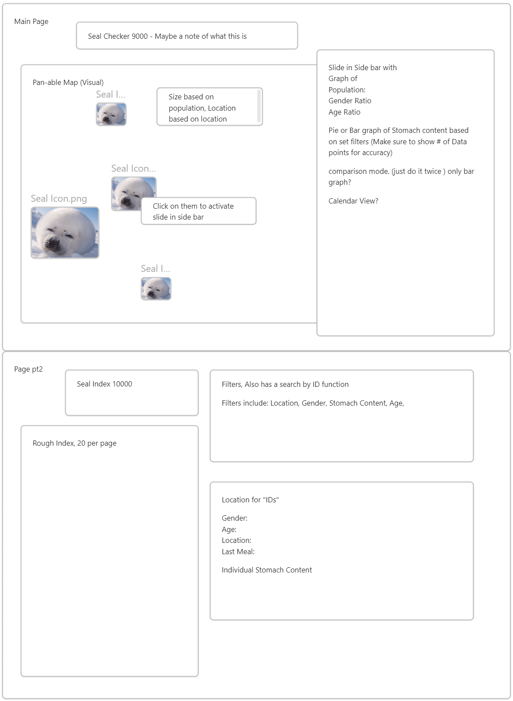
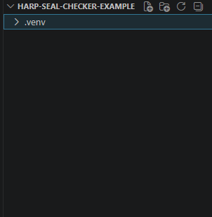
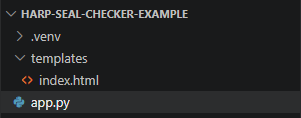
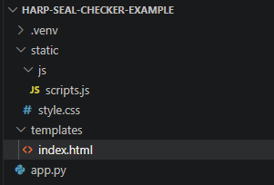
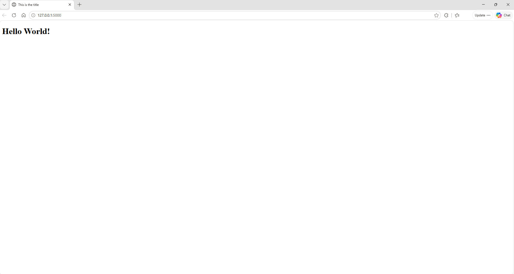
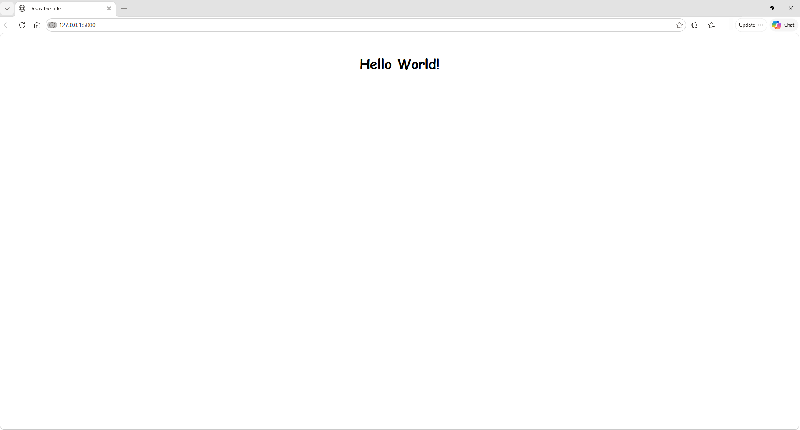
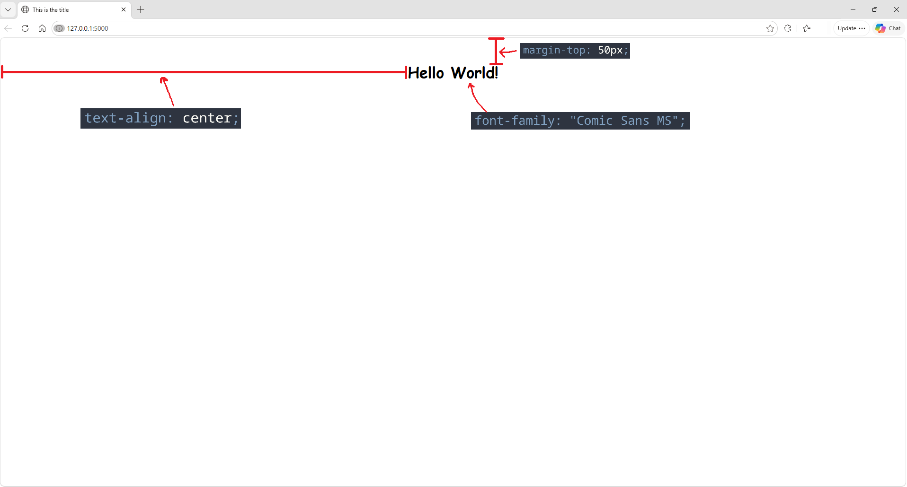

# Setting Up Your Web App
Here we will set up the file structure of our website and run a simple web application locally!
### Planning

All websites come from an idea. It's time to visualize our own. Lets draw out roughly what we want the web application to look like. The outline for the Seal Checker 9000 was made in a note-taking software called Obsidian. Though you could really make it on anything. Keep in mind your design for your web application isn't final! You have the final say in what you want the web app


Just keep in mind what you want to put on your website and write it down. This is for a) just incase you don't remember, and b) the next step(s)

***

## Obligitory AI Section

Now that we have a base for what we want, lets start by implement the general structure.  
There are two ways you could go about this. Either **Using Generative AI** or actually **learning HTML and CSS**

Here are the pros and cons
#### Generative AI
>**Pros:**
1. Very very fast and simple
2. Requires little to no knowledge to possibly get your desired outcome
>**Cons:**
1. You aren't learning HTML and CSS
2. Can lose track of the scope of your project
3. You don't understand the code
4. Potentially cause more harm than good depending on the scope of your project
4. Potential data risk 
5. RAM and SSD prices
6. All the other AI problems not specific to this project

#### Learning HTML and CSS
>**Pros:**
1. You learn HTML and CSS
2. Gets the job done
3. You can *generally* get what you want done
>**Cons:**
1. Very slow and tedious (varies based on background in CS)

#### Conclusion
If you have the time, learning the language is the best thing you can do. Otherwise, the best case senario is for you to use both and try to understand the code and logic of whatever AI model you're using. 

***

## General
Let's start! We are using Flask as our Framework, so if you followed Project Setup your workspace should look something like this. 



For our project. To run it locally this is what we will need



>Note:
>
>Flask uses Jinja2 as a default engine. You can follow [other tutorials](https://www.geeksforgeeks.org/python/templating-with-jinja2-in-flask/) to get started on this section. Again, Flask is one of the easiest web frameworks to use so it's hard to get wrong when following any tutorial.  

index.html can be split into individual files. Noteably a style.css file and a scripts.js file. This is done for organization.



Now we are all set to start making the web app.

From here we will make a simple page that says "Hello World!" on it. 

<gcds-details details-title="Use this code into your app.py">

``` python
from flask import Flask, render_template

app = Flask(__name__) 

@app.route('/')
def home():
    return render_template('index.html')

if __name__ == '__main__':
    app.run(debug=True)
```

</gcds-details>

* `app = Flask(__name__)` 
> Creates the flask class
* `@app.route(/)`
> Tells python what to run when someone visits your web app
* `return render_template('index.html')`
* `app.run(debug=True)` 


<gcds-details details-title="Paste this code into your index.html">

``` html
<!DOCTYPE html>
<html lang="en">
<head>
    <meta charset="UTF-8">
    <meta name="viewport" content="width=device-width, initial-scale=1.0">
    <title>This is the title</title>
</head>
<body>
    <h1>Hello World!</h1>
</body>
</html>
```

</gcds-details>

Then to run your webapp, first make sure you are in the right environment. This is what is should look like: 

```
(.venv) yourusername:~/Harp-Seal-Checker-Example$
```
Then run the following command in that environment
```
python -m flask --app app run 
```
Then you should see this pop up
```
 * Serving Flask app 'app'
 * Debug mode: off
WARNING: This is a development server. Do not use it in a production deployment. Use a production WSGI server instead.
 * Running on http://127.0.0.1:5000
Press CTRL+C to quit
```
`Ctrl + Left Click` on the link (http://127.0.0.1:5000) to access the locally run server. Right now you should see:


<gcds-details details-title="Let's add a quick bit of CSS, add this to your style.css:">

```css
h1 {
    font-family: "Comic Sans MS";
    text-align: center;
    margin-top: 50px;
}
```

</gcds-details>

After relaunching your page because you added a new file, it should look like:


Here is what each of the parts of the css is doing to text contained in `<h1>`


#### Learn More About Languages
To learn more, here are some websites you can reference:

[W3Schools (CSS)](https://www.w3schools.com/Css/)

[W3Schools (Python)](https://www.w3schools.com/python/)

[W3Schools (JS)](https://www.w3schools.com/html/)

[GeeksForGeeks (CSS)](https://www.geeksforgeeks.org/css/css-tutorial/)

[GeeksForGeeks (Python)](https://www.geeksforgeeks.org/python/python-programming-language-tutorial/)

[GeeksForGeeks (JS)](https://www.geeksforgeeks.org/javascript/javascript-tutorial/)
#### Others Sites/Documentations 
Here are some other websites referenced to make the Seal Checker 9000 demo. 

Flask: [GeeksForGeeks (Flask)](https://www.geeksforgeeks.org/python/templating-with-jinja2-in-flask/)

Maps: [Folium Documentation](https://folium.readthedocs.io/en/latest/)

Charts: [Chart.js](https://www.chartjs.org/docs/latest/)
