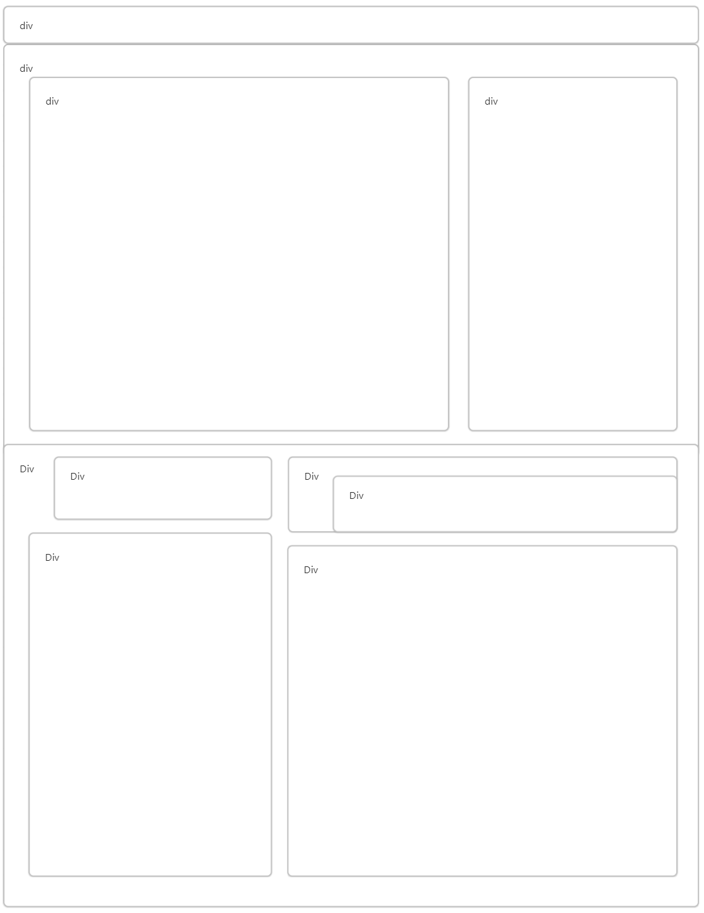
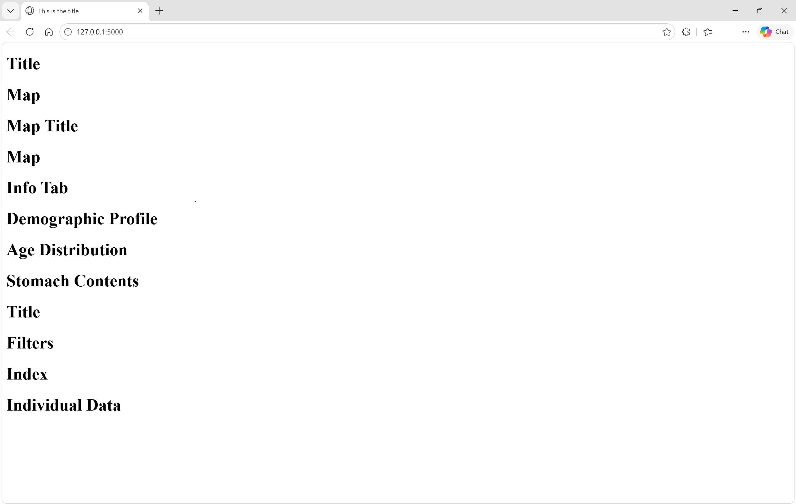
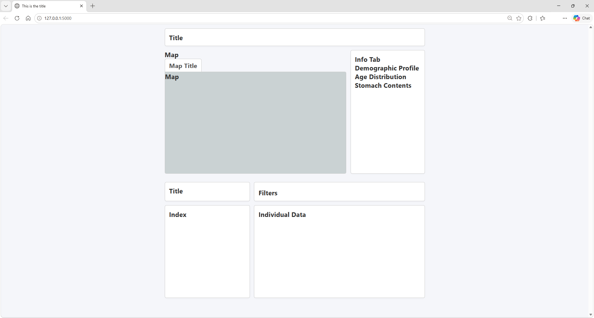

# Building Your Web App

Now that you know have your locally hosted website up and running, lets start adding features. This is where we will explain how to make everything you see on the Seal Checker 9000.
 
### HTML Structure
Lets get the general structure of the website down. Let's refer back to 


Lets break this down into it's html sections. In the following diagram we can see the divisions that will be used to make this website. I will show it translated into code after the image.


Here is the html that this is translated into, Note that there are some titles indicating the section the division belongs to:
``` html
<!DOCTYPE html>
<html lang="en">
<head>
    <meta charset="UTF-8">
    <meta name="viewport" content="width=device-width, initial-scale=1.0">
    <title>This is the title</title>
    <link rel="stylesheet" href="{{ url_for('static', filename='style.css') }}">
</head>
<body>

    <div class="page-container">

        <!-- Title -->
        <div>
            <h1>Title</h1>
        </div>

        <!-- Map and Sidebar Section -->
        <div>
            <!-- Map -->
            <div>
                <h1>Map</h1>
                <div>
                    <h1>Map Title</h1>
                </div>
                <div>
                    <h1>Map</h1>
                </div>
            </div>
            <!-- Sidebar -->
            <div>
                <h1>Info Tab</h1>
                <div>
                    <h1 id="side-title">Demographic Profile</h1>
                </div>
                <div>
                    <h1 id="side-title">Age Distribution</h1>
                </div>
                <div>
                    <h1>Stomach Contents</h1>
                </div>
            </div>
        </div>

        <!-- Seal Index Section -->
        <div>
            <!-- Title -->
            <div>
                <h1>Title</h1>
            </div>
            <!-- Filter Tab -->
            <div>
                <div>
                    <h1>Filters</h1>
                </div>
            </div>

            <!-- Bottom Left: List Index -->
            <div>
                <h1>Index</h1>
            </div>

            <!-- Bottom Right: Life Snapshot Details -->
            <div>
                <h1>Individual Data</h1>
            </div>
        </div>
    </div>
</body>
</html>
```

Now when running our web app this is what you see!



Now you may notice, this looks nothing like what we want. Everything just goes in a straight line downwards, it's all the same font, and there are no defined regions. What do we do???

### CSS Structure 
CSS! CSS will allow us to customize the way our web app looks. But before we do this, we have to go back and give our divisions classes. This is so we can specify which division we are talking about in the stylesheet.  

This is the previous with classes added

``` html
<!DOCTYPE html>
<html lang="en">
<head>
    <meta charset="UTF-8">
    <meta name="viewport" content="width=device-width, initial-scale=1.0">
    <title>This is the title</title>
    <link rel="stylesheet" href="{{ url_for('static', filename='style.css') }}">
</head>
<body>

    <div class="page-container">

        <!-- Title -->
        <div class="wireframe-box header-box">
            <h1>Title</h1>
        </div>

        <!-- Map and Sidebar Section -->
        <div class="map-section">
            <!-- Map -->
            <div class="map-outer">
                <h1>Map</h1>
                <div class="map-stationary-tab">
                    <h1>Map Title</h1>
                </div>
                <div class="map-viewport">
                    <h1>Map</h1>
                </div>
            </div>
            <!-- Sidebar -->
            <div class="wireframe-box sidebar-panel">
                <h1>Info Tab</h1>
                <div>
                    <h1>Demographic Profile</h1>
                </div>
                <div>
                    <h1>Age Distribution</h1>
                </div>
                <div>
                    <h1>Stomach Contents</h1>
                </div>
            </div>
        </div>

        <!-- Seal Index Section -->
        <div class="index-section">
            <!-- Title -->
            <div class="wireframe-box index-header-left">
                <h1>Title</h1>
            </div>
            <!-- Filter Tab -->
            <div class="wireframe-box index-header-right">
                <div class="filter-grid">
                    <h1>Filters</h1>
                </div>
            </div>

            <!-- Bottom Left: List Index -->
            <div class="wireframe-box index-body-left">
                <h1>Index</h1>
            </div>

            <!-- Bottom Right: Life Snapshot Details -->
            <div class="wireframe-box index-body-right">
                <h1>Individual Data</h1>
            </div>
        </div>
    </div>
</body>
</html>
```

This is the CSS

``` css
* {
    box-sizing: border-box;
    margin: 0;
    padding: 0;
    font-family: -apple-system, BlinkMacSystemFont, "Segoe UI", Roboto, Arial, sans-serif;
}

body {
    background-color: #f5f6fa;
    color: #333;
    overflow-y: scroll;
}

.page-container {
    max-width: 1300px;
    margin: 0 auto;
    padding: 20px;
    display: flex;
    flex-direction: column;
    gap: 30px;
}

.wireframe-box {
    background: white;
    border: 2px solid #ccc;
    border-radius: 8px;
    padding: 20px;
    box-shadow: 0 4px 6px rgba(0, 0, 0, 0.02);
}

.header-box {
    margin-bottom: -10px;
}

.header-box a {
    color: #3498db;
    text-decoration: none;
    font-size: 0.9em;
    font-weight: bold;
}

.header-box a:hover {
    text-decoration: underline;
}

.map-section {
    display: flex;
    gap: 20px;
    height: 600px;
    position: relative;
}

.map-outer {
    flex: 1;
    display: flex;
    flex-direction: column;
    height: 100%;
    min-width: 0;
}

.map-stationary-tab {
    background: #ffffff;
    border: 2px solid #ccc;
    border-bottom: none;
    border-top-left-radius: 8px;
    border-top-right-radius: 8px;
    padding: 10px 20px;
    font-weight: bold;
    font-size: 0.95rem;
    color: #555;
    width: fit-content;
}

.map-viewport {
    flex: 1;
    border: 2px solid #ccc;
    border-bottom-left-radius: 8px;
    border-bottom-right-radius: 8px;
    border-top-right-radius: 8px;
    overflow: hidden; 
    position: relative;
    background-color: #cad2d3;
}

.map-viewport > div {
    height: 100% !important;
}

.map-viewport > div > div {
    height: 100% !important;
    padding-bottom: 0 !important;
}

.map-viewport iframe {
    width: 100% !important;
    height: 100% !important;
    border: none;
    display: block;
}

.sidebar-panel {
    width: 360px;
    flex-shrink: 0;
    height: 100%;
    overflow-y: auto;
}

.index-section {
    display: grid;
    grid-template-columns: 1fr 2fr;
    grid-template-rows: auto 1fr;
    gap: 20px;
    margin-top: 10px;
}

.index-header-left {
    grid-column: 1 / 2;
    grid-row: 1 / 2;
}

.index-header-right {
    grid-column: 2 / 3;
    grid-row: 1 / 2;
}

.index-body-left {
    grid-column: 1 / 2;
    grid-row: 2 / 3;
    display: flex;
    flex-direction: column;
    min-height: 450px;
    height: 100%; 
}

.index-body-right {
    grid-column: 2 / 3;
    grid-row: 2 / 3;
}

.index-list {
    flex-grow: 1;
    overflow-y: auto;
    border: 1px solid #ddd;
    border-radius: 4px;
    background: #fafafa;
    height: 0; 
}

.index-list-item {
    padding: 10px 15px;
    border-bottom: 1px solid #eee;
    cursor: pointer;
    font-size: 14px;
}

.index-list-item:hover {
    background: #eef2f5;
}

.filter-grid {
    display: flex;
    gap: 10px;
    margin-top: 8px;
    flex-wrap: wrap;
}

.filter-grid input, .filter-grid select {
    padding: 6px 10px;
    border: 1px solid #ccc;
    border-radius: 4px;
    flex: 1;
    min-width: 140px;
    font-size: 13px;
}
```

(These Functions will be explained more in the [Displaying Data](./Displaying-Data.md) section)

Great! Now what does our web app look like? (Zoomed out to see full page)



Now we are getting somewhere. Now that we have the general shape of our website down, lets look back at our plans. 


Lets add some of the changes to our web app so it isn't just a bunch of titles. 

Here is the CSS added: 
``` css
.header-box a {
    color: #3498db;
    text-decoration: none;
    font-size: 0.9em;
    font-weight: bold;
}

.header-box a:hover {
    text-decoration: underline;
}
```
and these are the HTML changes:
``` html
<!DOCTYPE html>
<html lang="en">
<head>
    <meta charset="UTF-8">
    <meta name="viewport" content="width=device-width, initial-scale=1.0">
    <title>This is the title</title>
    <link rel="stylesheet" href="{{ url_for('static', filename='style.css') }}">
</head>
<body>

    <div class="page-container">

        <!-- Title -->
        <div class="wireframe-box header-box">
            <h1>Seal Checker 9000</h1>
            <p style="color: #666; margin-top: 5px;">
                Stomach content data for harp seals (Pagophilus groenlandicus) collected in the waters around Newfoundland and Labrador (NL): 2017-2021.
            </p>
            <a href="https://open.canada.ca/data/en/dataset/7538501c-cd3d-4ee0-8b4a-476a625957d6" target="_blank">
                (Database on Open Canada)
            </a>            
        </div>

        <!-- Map and Sidebar Section -->
        <div class="map-section">
            <!-- Map -->
            <div class="map-outer">
                <div class="map-stationary-tab">
                    <h1>Map of 🦭</h1>
                </div>
                <div class="map-viewport">
                    <h1>[Put folium here]</h1>
                </div>
            </div>
            <!-- Sidebar -->
            <div class="wireframe-box sidebar-panel">
                <h3 id="side-title">Select a Zone on the Map</h3>
                <hr style="margin: 10px 0;">
                <div>
                    <h1>Demographic Profile</h1>
                </div>
                <div>
                    <h1>Age Distribution</h1>
                </div>
                <div>
                    <h1>Stomach Contents</h1>
                </div>
            </div>
        </div>

        <!-- Seal Index Section -->
        <div class="index-section">
            <!-- Title -->
            <div class="wireframe-box index-header-left">
                <h2>Seal Index 10000</h2>
                <p style="color: #666; margin-top: 5px;">Search for Individual Seals</p>
            </div>
            <!-- Filter Tab -->
            <div class="wireframe-box index-header-right">
                <div class="filter-grid">
                    <h1>Filters</h1>
                </div>
            </div>

            <!-- Bottom Left: List Index -->
            <div class="wireframe-box index-body-left">
                <h4>Index</h4>
            </div>

            <!-- Bottom Right: Life Snapshot Details -->
            <div class="wireframe-box index-body-right">
                <h1>Individual Data</h1>
            </div>
        </div>
    </div>
</body>
</html>
```

Now we are cooking with gas


Now all that's left to do is to add the actual functionality to our website. But wait a minute, how are they going to show data, when there is no data to show? *Smooth Segue to Next Page*