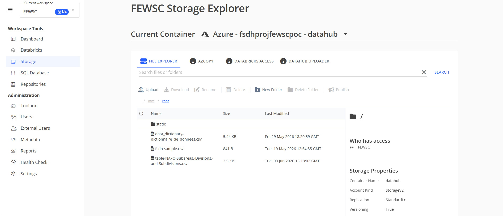

# Processing Data

It's time to prepare the data we are going to use. In the Seal Checker 9000 and the Seal Index 10000 we are turning info from a .csv file on the FSDH into usable data. We will be using Azure Blob Storage for this, not Postgres. 

### Referencing a File From the FSDH Storage

**Step 1: Getting a storage access token**

From the FSDH access your workspace:

Navigate to the storage page

This is your Storage Explorer. Here you can manually upload and download files. 

Now go to the AZCOPY tab

This is where you get your key. Remember, <u>unless someone has provided you with a longer term token, this token will expire in *30* minutes</u>. Refresh the page when you want a new token.


**Step 2: Accessing the files**

Now let's try to access these files from your web application. For this we will have to import the pandas library and read the SAS token from the environment variables. 
<gcds-details details-title="The following block of code is a function that imports a file based on the file path in the Azure Blob Storage Explorer.">

``` python
import os
import pandas as pd #Import Panda Library

#Starting Variables
AZURE_SAS_URI = os.environ.get("SAS") #Place SAS Token In the Quotations or load from environment
# The variables aren't technically necessary, 
# But it's nice to have everything in one place
# These are the variables/files I used
SEALS_BLOB_NAME = "FSDHstatic/OPENDATA_HarpDietData2017-2021_EN.csv"
NAFO_BLOB_NAME = "FSDHstatic/NAFO-Subdivision-General-Coordinates.csv"
ICON_BLOB_NAME = "FSDHstatic/Seal-Icon.png"

#Functions
#This is the process of appending the token automatically
#This is done so adding new files later on isn't tedious
#This wasn't a problem for me as I only needed 3 files 
def load_df_from_azure(blob_name, encoding='utf-8'):
    full_sas_uri = AZURE_SAS_URI 
    if not full_sas_uri: #Checks if token is valid
        print("[DEBUG] AZURE_SAS_URI is not set.")
        return None
    try:
        # Build file path URL with the SAS token attached
        if "?" in full_sas_uri:
            base_uri, token = full_sas_uri.split("?", 1)
            if not base_uri.endswith("/"):
                base_uri += "/" #splits token
            file_uri = f"{base_uri}{blob_name}?{token}" 
        else:
            file_uri = f"{full_sas_uri}/{blob_name}" if not full_sas_uri.endswith("/") else f"{full_sas_uri}{blob_name}"
        df = pd.read_csv(file_uri, encoding=encoding)
        return df
    except Exception as e: #Error Handling
        print(f"[DEBUG] Error loading {blob_name} from Azure Storage: {e}")
        return None
```

</gcds-details>

<gcds-details details-title="from here we can reference the files like this:">

``` python
df = load_df_from_azure(NAFO_BLOB_NAME)
```

</gcds-details>

The next section will cover processing data using the pandas python library using this file.
***
### Extracting Data out of a [CSV File](https://www.geeksforgeeks.org/data-analysis/csv-file-format/) Using Panda

The main issue with having a file is that taking the data out of is a headache. The [pandas python library](https://pypi.org/project/pandas/) makes that process a lot simpler. 

>**Preface: [CSV](https://docs.python.org/3/library/csv.html) vs [Pandas](https://pypi.org/project/pandas/)**
>
>Before we start we have to decide which library we are going to use to process our csv file. The two main libraries you have to pick from are CSV and Pandas. Now it make seem like a no-brainer to pick the library that has the same name as the file format, but there are many pros and cons to both which is why pandas is the library of choice for this web app.
>
>**CSV**
>
>*Pros*:
>
>1. No dependencies (Built into Python)
>2. Low memory usage (Reads line-by-line)
>3. Fast for simple tasks (Extracting, appending, or writting a list of rows)
>
>*Cons*:
>
>1. Everything read as a string (Manual type conversion)
>2. Low Flexability (No grouping data, merging, or joining files, sorting, etc.)
>3. Reads missing data as empty strings 
>
>**Pandas**
>
>*Pros*:
>
>1. Can do complex operations (Can group, pivot, merge, filter, aggregate data with a few lines of code)
>2. Automatically detects data types (int,float,bool)
>3. Can perform math/string operations across columns (build on NumPy)
>4. Identifies Missing/null values and has multiple ways to handle them
>5. Can be easily used with other librarys for data science, machine elarning, or visualization
>
>*Cons*:
>
>1. Loads entire dataset into RAM (generally 5-10x the file size used in memory)
>2. Must be installed externally (requirements.txt)
>3. Steep learning curve 
>4. Can be overkill for simple tasks
>
>In this project, the main thing is that the entire seal dataset is only 19000 rows which may seem like alot, but it ends up with a size of less than 2 MB (at most 10MB of ram usage) which means there is no real point in using CSV when Pandas allows for that much more flexability.

[This code](https://github.com/HamSamm/Harp-Seal-Checker/blob/main/app.py) is home to everything use to turn the data from a .csv file to easily digestable and displayable data for our web application. Here is a step by step breakdown. 

**Step 3: Finding what you want**

The first step of taking data out of these files is finding what you want. 


<gcds-details details-title="The following function finds the column number of a type of data based on the column title. Though redundant it allows flexability in the files that are imported. So long as the lables are the same, the position of the columns don't matter.">

``` python
def find_col(df, options): # Function that finds the column number of a specified column title
    for opt in options: # Goes through every possible name for the column, 
        for col in df.columns: # Checks every filled column in our file. 
            if col.strip().lower() == opt.lower(): #Check if it matches
                return col 
    for opt in options: # Redundant Check if all previous checks fail fails
        for col in df.columns:
            cleaned_col = col.strip().lower()
            cleaned_opt = opt.lower()
            if cleaned_opt in cleaned_col or cleaned_col in cleaned_opt:
                return col
    return None # Fail 
```

</gcds-details>

Using this, we prepare the NAFO Reference file. This file was manually typed out based on an image and a map and represents the coordinates of specific fishing zones. 

<gcds-details details-title="Since coordinates are precalculated inside this file, we can map each zone code directly to its lat/long coordinates.">

``` python
def load_nafo_reference():
    try:
        # Load the NAFO Coordinates from blob
        df = load_df_from_azure(NAFO_BLOB_NAME)
        if df is None:
            print("[DEBUG] Azure load failed for NAFO reference CSV.")
            return {}

        df.columns = [c.strip().replace('\ufeff', '') for c in df.columns]
        
        # Match layout parameters
        div_col = find_col(df, ['zone'])
        lat_col = find_col(df, ['lat'])
        lon_col = find_col(df, ['long'])
        
        nafo_map = {}
        if div_col and lat_col and lon_col:
            # Safely cast coordinates to float
            df[lat_col] = pd.to_numeric(df[lat_col], errors='coerce')
            df[lon_col] = pd.to_numeric(df[lon_col], errors='coerce')
            df = df.dropna(subset=[lat_col, lon_col])
            
            # Direct mapping (one row per NAFO code, no groupby or mean calculation required)
            for _, row in df.iterrows():
                div_clean = str(row[div_col]).strip().upper()
                nafo_map[div_clean] = (float(row[lat_col]), float(row[lon_col]), f"{div_clean} (NAFO)")
            
        return nafo_map
    except Exception as e:
        print(f"Error processing NAFO reference CSV: {e}")
        return {}
```

</gcds-details>

Now that we have an easily readable and accessable file, we can do all the processing! (Of course after getting the seal data).

**Step 4: Processing Grouped Data with Pandas**

In our actual seal dataset, each row in the raw CSV does not represent a unique seal. Instead, each row represents a *single prey item* found inside a seal's stomach. 

This means a single seal (like `SEAL-10023`) might have 5 separate rows in the CSV: one row for 12 Capelin, one row for 2 Atlantic Cod, and so on. To build a profile for each individual seal, we must group these rows using Pandas.

<gcds-details details-title="Here is the logic our parser uses:">

```python
def parse_seals_csv():
    # Load NAFO Divisions reference file (directly maps zone to precalculated coordinates)
    nafo_map = load_nafo_reference() 
    
    # Try loading from Azure Storage first
    df = load_df_from_azure(
        blob_name=SEALS_BLOB_NAME
    )
    
    # If Azure loading fails, return an empty list (ERROR)
    if df is None:
        print("[DEBUG] Azure load failed for seals CSV. Returning empty dataset.")
        return []
        
    df.columns = [c.strip() for c in df.columns]

    id_col = find_col(df, ['sealid'])
    gen_col = find_col(df, ['sex'])
    age_col = find_col(df, ['age'])
    nafo_col = find_col(df, ['nafo'])
    prey_col = find_col(df, ['prey'])
    num_col = find_col(df, ['numberoflineitems'])
    
    if not id_col:
        print("[DEBUG] 'SealID' column absent. Returning empty dataset.")
        return []
        
    df[id_col] = df[id_col].astype(str).str.strip()
    grouped = df.groupby(id_col)
    seals_list = []
    
    for seal_id, group in grouped:
        gen = 'U'
        if gen_col:
            raw_gen = group[gen_col].iloc[0]
            if not pd.isna(raw_gen) and str(raw_gen).strip():
                gen = str(raw_gen).strip().upper()[0]
                    
        age_display = 'Unknown'
        age_num = None
        if age_col:
            raw_age = group[age_col].iloc[0]
            if not pd.isna(raw_age) and str(raw_age).strip() and str(raw_age).upper() not in ['NA', 'NAN']:
                try:
                    age_num = int(float(raw_age))
                    age_display = f"{age_num} years"
                except:
                    pass
                    
        nafo = 'Unknown'
        if nafo_col:
            raw_nafo = group[nafo_col].iloc[0]
            if not pd.isna(raw_nafo) and str(raw_nafo).strip():
                nafo = str(raw_nafo).strip()
                
        # Default fallback to Newfoundland and Labrador centroid
        lat, lon, area_name = 50.5, -56.5, f"{nafo} (NAFO)"
        
        nafo_upper = nafo.upper()
        if nafo_map and nafo_upper in nafo_map:
            lat, lon, area_name = nafo_map[nafo_upper]
            
        prey_items = {}
        total_items = 0
        
        for _, row in group.iterrows():
            if prey_col:
                prey_val = row[prey_col]
                # '9998' and 'empty' correctly represent empty stomachs
                if pd.isna(prey_val) or str(prey_val).strip() == '' or str(prey_val).lower() == 'empty' or 'empty' in str(prey_val).lower() or '9998' in str(prey_val):
                    continue
                    
                prey_name = str(prey_val).strip()
                # Clean prefix codes (e.g., "1 Capelin" -> "Capelin")
                if prey_name.startswith(('1', '2', '3', '4', '5', '6', '7', '8', '9', '0')):
                    parts = prey_name.split(maxsplit=1)
                    if len(parts) > 1:
                        prey_name = parts[1]
                        
                count = 1
                if num_col and not pd.isna(row[num_col]):
                    try:
                        count = int(float(row[num_col]))
                    except:
                        pass
                        
                prey_items[prey_name] = prey_items.get(prey_name, 0) + count
                total_items += count
                 
        if not prey_items:
            prey_items['Empty'] = 1
            meal = "Empty"
        else:
            meal = max(prey_items, key=prey_items.get)
            
        seals_list.append({
            "id": f"SEAL-{seal_id}",
            "raw_id": seal_id,
            "lat": lat,
            "lon": lon,
            "gender": gen,
            "age": age_display,
            "age_num": age_num,
            "area": area_name,
            "nafo_zone": nafo,
            "meal": meal,
            "prey_contents": prey_items,
            "total_prey_items": total_items
        })
        
    return seals_list
```

</gcds-details>


#### Why are we grouping by ID?
If we didn't group by ID, our Seal Index list would show the same seal multiple times (once for each prey item they ate). This is mainly due to the way the information was gathered so this step may or may not be relevant to you.

**Step 5: General Formatting**

>Note:
>The data file referenced doesn't have formatting issues but these systems could be put in place for future file expansion.

*Name Formatting*

When assigning an identifier to each seal, we check if a valid `id_col` exists. If the column is missing or a row lacks an entry, we build a generic fallback identifier based on the DataFrame iteration index (e.g., Seal-12). In the grouped code, we attach a standard string prefix to the raw ID (e.g. `f"SEAL-{seal_id}"`).

*Gender Formatting*

Simplify the possible labels for gender into three possibilities: 'M', 'F', or 'U' (Unknown). 

<gcds-details details-title="This maps directly to our demographic chart filters:">

``` js
// From ratioChart inside chart.js:
labels: ['Male', 'Female', 'Unknown']
```

</gcds-details>

*Numerical and Categorical Ageing*

<gcds-details details-title="The age_num field is converted to an integer to later calculate averages and dynamic grouping:">

```js
// From global.js
for (let i = 0; i <= maxAge; i += 3) {
    bins.push({ label: `${i}-${i+2}`, min: i, max: i+2, count: 0 });
}
```

</gcds-details>

If the age cannot be converted to a number, or contains non-numeric strings, it defaults to None in Python, which becomes a JavaScript null and is sorted into the "Unknown" bin, while `age_display` is formatted as `"Unknown"`.

**Step 6: Extracting Stomach Content and Identifying the "Last Meal"**

Displaying the harp seal's diet is the main part of our design. Rather than reading statically defined columns, we loop through the rows belonging to each grouped seal to construct a dynamic, unified dictionary of active prey items.

*Quantifying Total Prey Items*

The variable `total_items` tallies up the sum of all prey quantities found in the stomach using the line item counts column. This number displays directly in the side panels and individual profile views.

*Defining the Last Meal*

<gcds-details details-title="The seal's last meal is calculated as the prey item with the highest count in that record using the following:">

```python
meal = max(prey_items, key=prey_items.get)
```

</gcds-details>

<gcds-details details-title="If no prey items are found, or the records contain empty stomach keys (like 'empty' or '9998'), the stomach is flagged as empty.">

``` example
No prey found -> prey_items = {"Empty": 1} -> Last Meal = "Empty"
Prey found    -> prey_items = {"Capelin": 12, "Cod": 2} -> Last Meal = "Capelin"
```

</gcds-details>

This structural normalization prevents crashes on the frontend and keeps our donut charts and search index lists running smoothly.
***