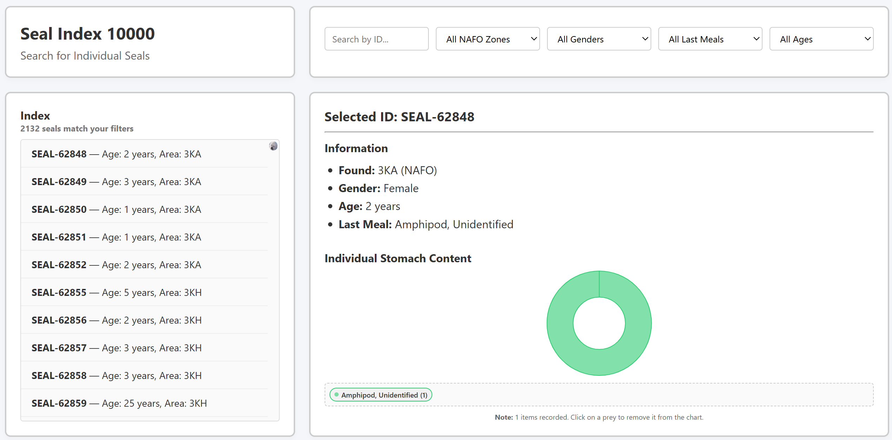
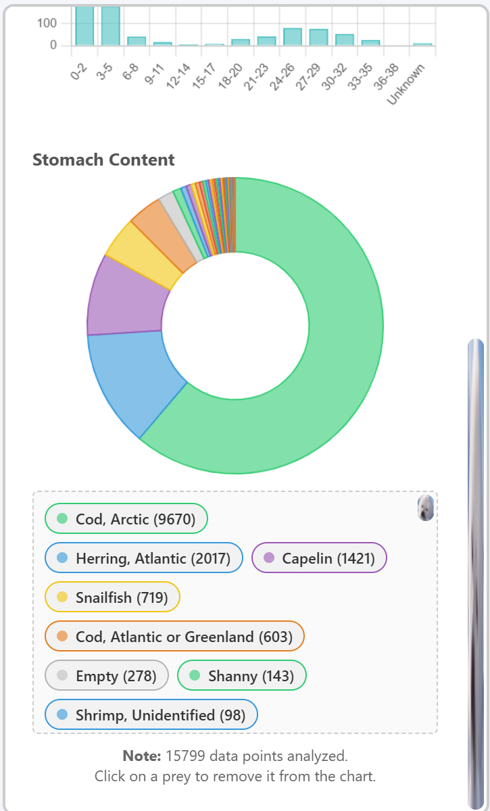
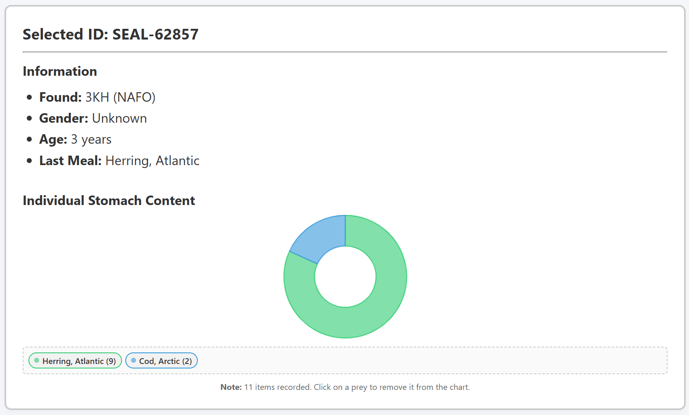
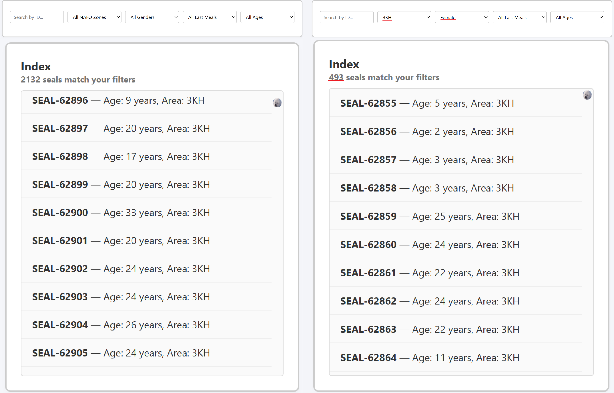
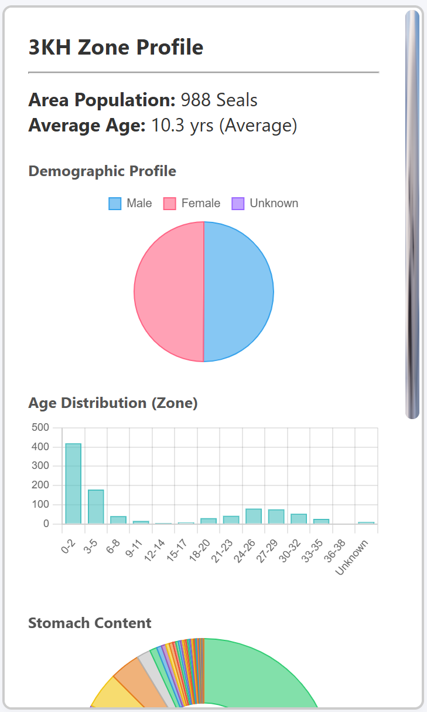

# Displaying Data 

Now that we have the basic HTML structure and the data processed, it's time to make the web application look good and function in general.

We will be using CSS, JS, and Python. (Code blocks will not be minimized in this section)

## 1. [CSS Styling](https://www.w3schools.com/Css/): Making the Design Not Bad

Our `style.css` file is our next stops
### Base Styles

```css
* {
    box-sizing: border-box;
    margin: 0;
    padding: 0;
    font-family: -apple-system, BlinkMacSystemFont, "Segoe UI", Roboto, Arial, sans-serif;
}

body {
    background-color: #f5f6fa;
    color: #333;
    overflow-y: scroll;
}
```
*   The `*` selector is a universal reset/something that applies for everything. it sets `box-sizing: border-box` (very important for layout predictability), and removing default `margin` and `padding` from all elements. Can be used to create very simple general themes.
*   The `body` defines the overall background color (`#f5f6fa`), text color (`#333`), and ensures vertical scrolling is always available.

### Page Container and Wireframe Boxes

```css
.page-container {
    max-width: 1300px;
    margin: 0 auto;
    padding: 20px;
    display: flex;
    flex-direction: column;
    gap: 30px;
}

.wireframe-box {
    background: white;
    border: 2px solid #ccc;
    border-radius: 8px;
    padding: 20px;
    box-shadow: 0 4px 6px rgba(0, 0, 0, 0.02);
}
```

*   `.page-container` acts as the main content wrapper, centering the entire application (`margin: 0 auto`), limiting its width, and using `flexbox` (`display: flex`, `flex-direction: column`, `gap`) to stack major sections vertically with consistent spacing.
*   `.wireframe-box` is a utility class applied to many sections (header, sidebar, index panels) to give them a consistent card-like appearance with a white background, a light gray border, rounded corners, and a subtle shadow.

### Header Styling

```css
.header-box {
    margin-bottom: -10px; /* Adjusts spacing with the next section */
}

.header-box a {
    color: #3498db;
    text-decoration: none;
    font-size: 0.9em;
    font-weight: bold;
}

.header-box a:hover {
    text-decoration: underline;
}
```
*   These styles specifically target the header, adjusting its margin and styling the link to the external database with a distinct blue color, removing default underlines, and adding a hover effect.

### Map Section Layout

```css
.map-section {
    display: flex;
    gap: 20px;
    height: 600px;
    position: relative;
}

.map-outer {
    flex: 1;
    display: flex;
    flex-direction: column;
    height: 100%;
    min-width: 0;
}

.map-stationary-tab {
    background: #ffffff;
    border: 2px solid #ccc;
    border-bottom: none;
    border-top-left-radius: 8px;
    border-top-right-radius: 8px;
    padding: 10px 20px;
    font-weight: bold;
    font-size: 0.95rem;
    color: #555;
    width: fit-content;
}

.map-viewport {
    flex: 1;
    border: 2px solid #ccc;
    border-bottom-left-radius: 8px;
    border-bottom-right-radius: 8px;
    border-top-right-radius: 8px;
    overflow: hidden; 
    position: relative;
    background-color: #cad2d3; /* Placeholder background */
}
```
*   `.map-section` uses `flexbox` to lay out the map and the sidebar side-by-side. It sets a fixed `height` for this section.
*   `.map-outer` makes sure the map itself takes up available space (`flex: 1`) and is vertically stacked with its tab.
*   `.map-stationary-tab` stylizes the title, making it look like a tab attached to the map.
*   `.map-viewport` is where we embed the Folium map.
    *   `flex: 1` allows it to fill the remaining vertical space.
    *   `overflow: hidden` ensures the map content doesn't spill out.
    *   `background-color: #cad2d3` provides a visual cue while the map loads.
    *   The additional rules (`.map-viewport > div`, `.map-viewport > div > div`, `.map-viewport iframe`) are overrides to ensure the Folium map fills its container without random blank boxes or scrollbars.

### Sidebar Panel

```css
.sidebar-panel {
    width: 360px;
    flex-shrink: 0; /* Prevents sidebar from shrinking */
    height: 100%;
    overflow-y: auto; /* Enables scrolling */
}
```
*   `.sidebar-panel` is given a fixed width (`360px`) and `flex-shrink: 0` to prevent it from collapsing. `overflow-y: auto` is crucial for allowing the content (especially the charts and legends) to scroll independently if it exceeds the panel's height.

### Seal Index Section Layout

```css 
.index-section {
    display: grid;
    grid-template-columns: 1fr 2fr; /* Left column 1/3, Right column 2/3 width */
    grid-template-rows: auto 1fr; /* Top row takes content height, bottom row takes remaining height */
    gap: 20px;
    margin-top: 10px;
}

/* Specific grid area placements */
.index-header-left { grid-column: 1 / 2; grid-row: 1 / 2; }
.index-header-right { grid-column: 2 / 3; grid-row: 1 / 2; }
.index-body-left { grid-column: 1 / 2; grid-row: 2 / 3; }
.index-body-right { grid-column: 2 / 3; grid-row: 2 / 3; }
```
*   The `.index-section` cleverly uses **CSS Grid** to create a 2x2 layout at the bottom of the page.
    *   `grid-template-columns: 1fr 2fr` makes the left column one-third width and the right column two-thirds.
    *   `grid-template-rows: auto 1fr` makes the top row (headers) adjust to its content, while the bottom row (index list and details) fills the remaining vertical space.
    *   `grid-column` and `grid-row` properties then place the individual `.index-header-left`, `.index-header-right`, `.index-body-left`, and `.index-body-right` elements into their respective grid cells.

### Index List and Filters

```css
.index-list {
    flex-grow: 1;
    overflow-y: auto;
    border: 1px solid #ddd;
    border-radius: 4px;
    background: #fafafa;
    height: 0; /* Essential for flex-grow to work in a flex column */
}

.index-list-item {
    padding: 10px 15px;
    border-bottom: 1px solid #eee;
    cursor: pointer;
    font-size: 14px;
}

.index-list-item:hover {
    background: #eef2f5;
}

.filter-grid {
    display: flex;
    gap: 10px;
    margin-top: 8px;
    flex-wrap: wrap; /* Allows filters to wrap to next line on smaller screens */
}

.filter-grid input, .filter-grid select {
    padding: 6px 10px;
    border: 1px solid #ccc;
    border-radius: 4px;
    flex: 1; /* Allows filters to grow and shrink */
    min-width: 140px;
    font-size: 13px;
}
```
*   `.index-list` is set up to grow and fill available space (`flex-grow: 1`) within its parent flex container (`.index-body-left`). `height: 0` is a common trick to make `flex-grow` calculate correctly when the parent is also a flex container in column direction. `overflow-y: auto` enables scrolling for the list of seals.
*   `.index-list-item` styles individual entries, adding padding, a bottom border, and a `cursor: pointer` to indicate interactivity. A `hover` effect provides visual feedback.
*   `.filter-grid` uses `flexbox` with `flex-wrap: wrap` to arrange the search input and dropdowns, allowing them to stack on smaller screens.
*   The input and select elements are styled for a clean, consistent look, and `flex: 1` allows them to share space within the grid.

[Take a screenshot of your web app (zoomed out if necessary) highlighting the grid structure of the index section and showing the styled filters and an initial list of seals. Ensure the map and sidebar are also visible to show the full layout.]


## 2. JavaScript Interactivity: Making It Dynamic

Our JavaScript files (`global.js`, `chart.js`, `ui.js`, `app.js`) work together to manage data, update the UI, and render interactive charts.

### The Global Data Source: `sealsData`

The most crucial part of the JavaScript is the `sealsData` global variable, which directly receives the processed data from our Flask backend:

```html
<script>
    const sealsData = {{ seals_data | tojson | safe }};
</script>
<script src="{{ url_for('static', filename='js/global.js') }}"></script>
<script src="{{ url_for('static', filename='js/chart.js') }}"></script>
<script src="{{ url_for('static', filename='js/ui.js') }}"></script>
<script src="{{ url_for('static', filename='js/app.js') }}"></script>
```

*   `sealsData` is a JavaScript array of objects, where each object represents a single seal with all its parsed attributes (`id`, `nafo_zone`, `gender`, `age`, `prey_contents`, etc.).
*   This array is the single source of truth for all client-side operations, eliminating the need for further server requests for filtering or chart updates once the page loads.
*   The order of script imports is important: `global.js` (which declares global chart instances) comes before `chart.js` (which defines chart functions) and `ui.js`/`app.js` (which call those functions).

### `global.js`: Core Utilities and Inter-Component Management

This file holds global state for Chart.js instances and helper functions.

```javascript
// Global State Variables
let ratioChartInstance = null;
let ageChartInstance = null;
let stomachChartInstance = null;
let detailStomachChartInstance = null; // Individual card chart

// Callback for the Folium map within the iframe (traditional fallback)
window.selectSealFromMap = function(zoneCode) {
    selectZone(zoneCode);
};

window.addEventListener('message', function(event) {
    if (event.data && event.data.type === 'selectZone') {
        selectZone(event.data.zone);
    }
});

function getAgeDistribution(sealsList) { /* ... logic for age binning ... */ }
```
*   **Chart Instances:** `let ...ChartInstance = null;` declares global variables to hold references to our Chart.js objects. This is essential for preventing memory leaks by allowing us to `destroy()` old charts before rendering new ones (handled in `chart.js`).
*   **Map Communication:** Folium maps are embedded in an `iframe`. To communicate clicks from the map *inside* the iframe to our main page *outside* the iframe, we use `window.addEventListener('message')`. When a user clicks a NAFO zone on the map, the Folium map (via its own JS) sends a `postMessage` event to the parent window, triggering our `selectZone` function in `ui.js`. `window.selectSealFromMap` is a legacy fallback.
*   **`getAgeDistribution(sealsList)`:** This utility function takes a list of seals and processes their `age_num` property to create frequency bins (e.g., "0-2 years", "3-10 years", "Unknown") suitable for the `ageChart`.

### `chart.js`: Chart Rendering Logic

This file encapsulates all the functions responsible for drawing and updating the Chart.js visualizations. Each function follows a similar pattern:

1.  **Get Canvas Context:** Locate the `<canvas>` element.
2.  **Destroy Old Chart:** If a chart instance already exists, `destroy()` it to clear resources.
3.  **Prepare Data:** Transform the input data into the `labels` and `data` arrays Chart.js expects.
4.  **Define Styles:** Set `backgroundColor` and `borderColor` for chart segments.
5.  **Create New Chart:** Instantiate a new `Chart` object with specified type, data, and options.

#### `updateDemographicsChart(males, females, unknowns)`
*   Renders a `pie` chart showing the proportion of male, female, and unknown seals in a selected zone.
*   `responsive: true` and `maintainAspectRatio: false` ensure the chart scales with its container.
*   A small `resizeDelay` prevents jerky animations on initial load or container resize.

#### `updateAgeChart(labels, counts)`
*   Displays a `bar` chart representing the age distribution of seals in the selected zone.
*   `scales.y.beginAtZero: true` is set for accurate representation of counts.
*   `plugins.legend.display: false` hides the default legend as the age bins are directly on the x-axis.

#### `updateStomachChart(preyContents, totalPreyItems)` (Zone Level)
*   Renders a `donut` chart showing the aggregated stomach content for all seals in a selected NAFO zone.
*   **Custom HTML Legend:** This function dynamically generates an HTML legend (`stomach-legend-container`) *outside* the chart canvas.
    *   It sorts prey items by quantity for better readability.
    *   Each legend item displays the prey label and its count.
    *   **Interactivity:** Clicking a legend item calls `stomachChartInstance.toggleDataVisibility(idx)` and `stomachChartInstance.update()`. This allows users to hide/show specific prey types on the donut chart directly from the custom legend, updating the opacity and text-decoration of the legend item to reflect its visibility state.
*   A `stomach-note` provides additional context.

#### `updateDetailStomachChart(preyContents, totalPreyItems)` (Individual Seal)
*   Similar to `updateStomachChart` but for an *individual* seal's stomach content, displayed in the "Life Snapshot Details" panel.
*   It also generates a custom HTML legend (`detail-stomach-legend-container`) with click-to-toggle visibility, but with slightly smaller styling suitable for its compact area.
*   A `detail-stomach-note` provides specific details for the individual seal.

<gcds-details details-title="Example of charts:">




</gcds-details>


### `ui.js`: UI Update and Data Aggregation Logic

This file contains the primary functions that react to user interactions (map clicks, list selections) and update the main UI elements and call the chart rendering functions.

```javascript
// Update sidebar panel contents and charts with aggregated data for a NAFO Zone (Map Selection)
function selectZone(zoneCode) { /* ... filter sealsData by zone, aggregate stats, update span elements, call chart functions ... */ }

// Update bottom snapshot details and individual charts for an individual seal (Index Selection)
function selectSeal(seal) { /* ... update span elements with seal details, call updateDetailStomachChart ... */ }

// Start application
function init() { /* ... calls renderInterface, populateFilters, and auto-selects initial items ... */ }

if (document.readyState === 'loading') {
    document.addEventListener('DOMContentLoaded', init);
} else {
    init();
}
```
*   **`selectZone(zoneCode)`:** This is triggered by a map click. It filters `sealsData` to get only seals from the specified `zoneCode`. Then, it iterates through these `zoneSeals` to calculate:
    *   `totalCount`
    *   `males`, `females`, `unknowns` (for demographics chart)
    *   `ageSum`, `ageCount` (for average age display and age chart)
    *   `aggregatedPrey` (for the zone-level stomach chart)
    It updates the text content of `<span id="side-pop">`, `<span id="side-age">`, and calls `updateDemographicsChart`, `updateAgeChart`, and `updateStomachChart`.
*   **`selectSeal(seal)`:** Triggered when a user clicks an item in the "Seal Index" list. It takes a `seal` object (the individual seal's data) and updates the detailed information in the "Life Snapshot Details" panel (`id`, `gender`, `age`, `location`, `meal`). It then calls `updateDetailStomachChart` to display the individual's stomach content.
*   **`init()`:** This function acts as the application's entry point, ensuring that:
    *   `renderInterface()` is called to initially populate the seal list.
    *   `populateFilters()` is called to set up the search filters.
    *   A `setTimeout` is used for auto-selection, ensuring that a default zone and seal are selected after the page and its layout have fully rendered, giving a good initial user experience.

### `app.js`: List Rendering and Filtering 

This file manages the "Seal Index" list and its search/filter functionality.

```javascript
// Populate list index
function renderInterface() { renderInterfaceFiltered(sealsData); }

function renderInterfaceFiltered(filteredList) { /* ... updates search-results-count, clears and re-populates index-list-container with index-list-item elements ... */ }

// Populate search filters dynamically based on sealsData
function populateFilters() { /* ... dynamically fills select options based on unique values in sealsData, attaches event listeners ... */ }

// Apply selected filters
function applyFilters() { /* ... reads filter values, filters sealsData, calls renderInterfaceFiltered ... */ }
```
*   **`renderInterface()` and `renderInterfaceFiltered(filteredList)`:** These functions are responsible for displaying the list of seals in the `index-list-container`. `renderInterfaceFiltered` takes an array of seals (either the full `sealsData` or a filtered subset) and dynamically creates clickable `index-list-item` divs for each seal. Each item has an event listener that calls `selectSeal(seal)` when clicked.
*   **`populateFilters()`:** This function is called once on application initialization. It scans `sealsData` to find all unique `nafo_zone`, `gender`, and `meal` values, and dynamically populates the `<select>` dropdowns in the filter grid. It also sets up predefined age categories. Crucially, it attaches `input` and `change` event listeners to all filter elements, so `applyFilters` is triggered whenever a filter value changes.
*   **`applyFilters()`:** This is the core filtering logic. When a filter changes, this function:
    1.  Reads the current values from the search input and all dropdowns.
    2.  Filters the entire `sealsData` array based on the selected criteria (ID search, NAFO zone, gender, stomach content, and age range).
    3.  Calls `renderInterfaceFiltered()` with the resulting filtered list to update the displayed seal entries.



By combining these CSS and JavaScript techniques, the Seal Checker 9000 transforms static HTML into a dynamic, data-rich, and interactive web application, allowing users to explore complex biological data with ease.

***

**Step 3: Exporting to JSON & Integrating with JavaScript**

Once the Pandas processing script formats the raw rows into a list of organized Python dictionaries, we send this data to the web client.

*The Jinja2 Bridge*

Using Flask's rendering environment, the parsed data array is attached to our page template using a global script variable within index.html:

``` html
<!-- Expose Python aggregated list as JS object --> 
<script>
    const sealsData = {{ seals_data | tojson | safe }};
</script>
```
Discriptions:

`tojson`: Automatically formats the Python list of dictionaries into a JSON array.

`safe`: Tells Jinja2 to avoid encoding quotes as raw HTML entities (e.g., changing " to &quot;), keeping the formatting of our dataset.

>>>
**Step 4: How the Frontend Uses the Processed Data**

Once loaded in the browser, our JavaScript files interact with the processed `sealsData` object dynamically. Here is a breakdown of how the structured data flows through the interface:

*Selection and Filtering (Map Interactivity)*

When a user selects a NAFO subdivision on the map, selectZone(zoneCode) (ui.js) filters the global dataset in the browser:

```js
const zoneSeals = sealsData.filter(s => s.nafo_zone === zoneCode);
```

*Chart Rendering*

The filtered results are analyzed to update the interface widgets and charts.
Demographics (Pie Chart): Tallies the occurrences of gender === 'M', gender === 'F', and unknown values (ui.js).
Age Distribution (Bar Chart): Calculates numerical bins using `age_num` (global.js) and updates the dynamic chart values.
Stomach Contents (Donut Chart): Iterates through each seal's prey_contents dictionary to sum prey species counts and build interactive visual guides.




By completing this structural integration between a clean Python backend parser and interactive frontend scripts, the Seal Checker 9000 translates complex raw data into an accessible, responsive dashboard.