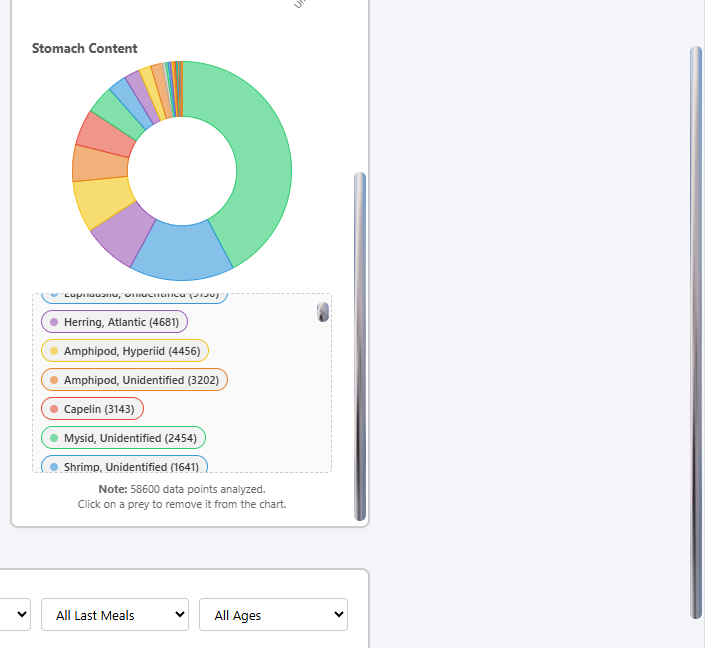

# Adding and Customizing the Map

Now that we have processed our dataset, we need a way to display where these seals are located. We will be using the [Folium library](https://folium.readthedocs.io/en/latest/) to create a map directly in Python, render it on our page, and make clicking on a zone update our statistics.

## 1. What is Folium?
Folium is a Python library that makes it easy to show data on an interactive [leaflet.js](https://leafletjs.com/) map. When Flask runs, Folium generates all the necessary HTML and JavaScript for the map behind the scenes, which we can drop straight into our `index.html` using:

```html
{{ map_html | safe }}
```

## 2. Generating the Map in Python
In `app.py`, we initialize the map using the coordinates of our dataset. If there are no seals found, we fall back to a default coordinate around Newfoundland and Labrador.

<gcds-details details-title="Note: It's on Lisgar now"> 

```python
if seals:
    # Initally placed with the assumption that tha lat and lon would be unique for all the seals in the area.
    avg_lat = sum(s['lat'] for s in seals) / len(seals) 
    avg_lon = sum(s['lon'] for s in seals) / len(seals)
    m = folium.Map(location=[avg_lat, avg_lon], zoom_start=5, control_scale=True, world_copy_jump=True)
else:
    m = folium.Map(location=[45.416141, -75.698076], zoom_start=5, control_scale=True, world_copy_jump=True)
```
 
</gcds-details> 

## 3. Creating Dynamic, Clickable Markers
Instead of standard map pins, we want custom round bubbles featuring our seal icon. To do this, we group our seals by NAFO zone and calculate the marker's size dynamically. Larger zones get larger bubbles!


<gcds-details details-title="We use Folium's `DivIcon` to inject custom HTML directly onto the map canvas:"> 

```python
# Linear scaling based on the number of seals in the zone
min_size = 30  # Smallest bubble
max_size = 75  # Largest bubble
size_range = max_size - min_size
ratio = num_seals_in_group / max_group_size
size = int(min_size + (ratio * size_range))

icon_html = f"""
<div onclick="window.parent.postMessage({{ type: 'selectZone', zone: '{zone}' }}, '*'); event.stopPropagation();" style="
    display: flex;
    flex-direction: column;
    align-items: center;
    cursor: pointer;
    width: {size}px;
">
    <div style="
        width: {size}px;
        height: {size}px;
        border: 2px solid #3498db;
        background: white;
        border-radius: 50%;
        overflow: hidden;
        box-shadow: 0 4px 10px rgba(0,0,0,0.15);
    ">
        
    </div>
    <div style="font-size: 10px; font-weight: bold; background: white; border-radius: 3px; padding: 1px 4px;">{zone}</div>
</div>
"""
```

</gcds-details> 

### The Iframe Communication Secret
Notice the `onclick` attribute inside the marker's HTML:
```javascript
window.parent.postMessage({ type: 'selectZone', zone: '3K' }, '*');
```
Because Folium maps are embedded as an isolated `<iframe>` (a website inside a website), our map cannot directly run JavaScript functions on the main page. 

To bridge this divide, the map "shouts" a message up to the parent window using `postMessage`. Back in our `global.js` file on the main page, we listen for this message:

```javascript
window.addEventListener('message', function(event) {
    if (event.data && event.data.type === 'selectZone') {
        selectZone(event.data.zone); // Update charts and statistics for this zone!
    }
});
```
This is how clicking a bubble on the map instantly updates our demographic charts, index count, and diet details!

But just having this map doesn't do much, we need our html file/template to take this map and display it. To do this we use  `_repr_html_` and then pass the result as a parameter as part of the [render_template](https://flask.palletsprojects.com/en/stable/api/#flask.render_template) method we imported from Flask so we a) run the html, and b) can access map_html and other important data/variables in index.html and every file connected to html (style.css and the .js files).

``` python 
    map_html = m._repr_html_()
    return render_template('index.html', map_html=map_html, seals_data=seals)
```

>Note: 
>
>This is how you pass anything to your html. This includes images you have stored on the FSDH. Although these should just be stored as static files, if they have to be on the fsdh, you can pass them as variables. For example, here we are passing the seal icon into html so I can use is as a part of the css. 
>``` 
>python return render_template('index.html', map_html=map_html, seals_data=seals, icon_url=icon_url)
>```
>we then reference it in the html file to pass it to the css in the body block
>``` html
><body style="--seal-icon-url: url('{{ icon_url }}');">
>```
>then we reference it in the css file like so
>``` css
>*::-webkit-scrollbar-thumb {
>    background-image: var(--seal-icon-url); /* <- Like this */
>    background-size: 100% 100%;
>    background-position: center;
>    border-radius: 8px;
>    background-clip: padding-box;
>    background-color: #ccc;
>    border: 2px solid transparent;
>}
>```
> And now we made all our scroll bars on any chromium-based browser seals!
>