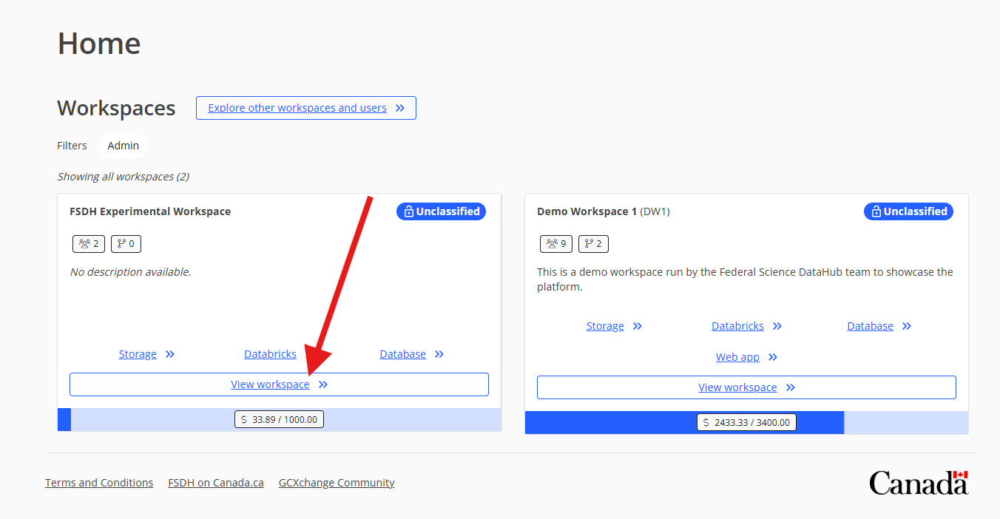
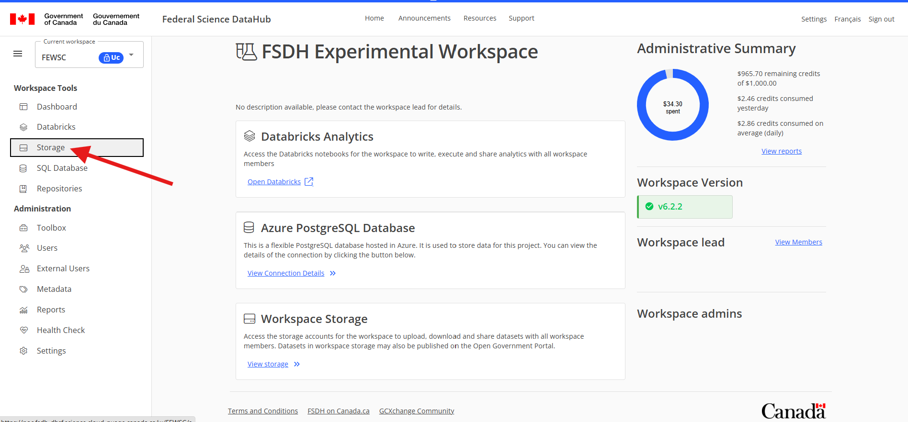
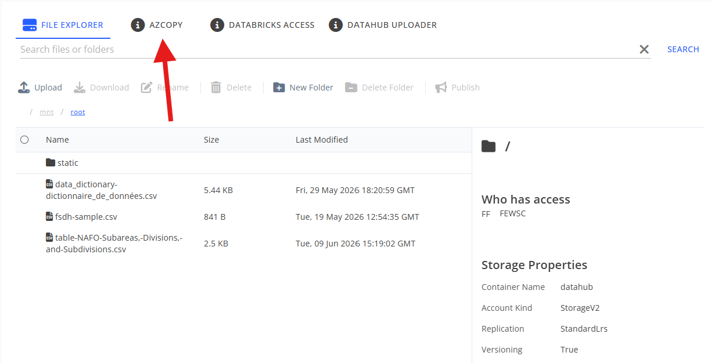
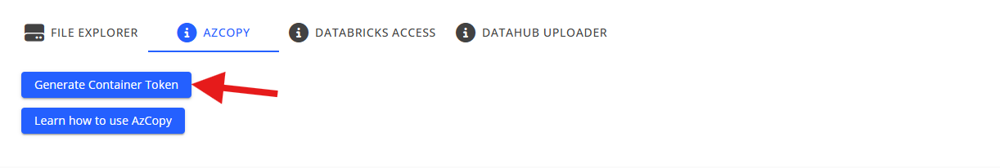
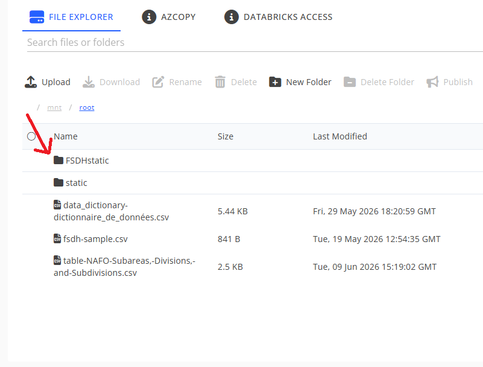
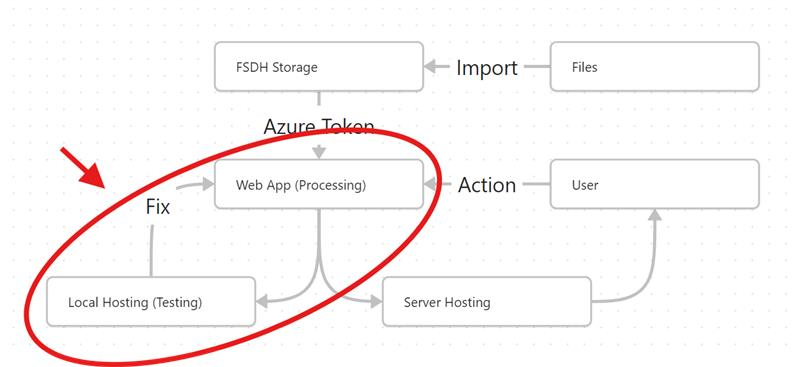

# Accessing Files from the FSDH

To access your data from the FSDH, you can use Azure Blob Storage, PostgreSQL, and other tools. Here we will be using **Azure Blob Storage**.

## Referencing a File From the FSDH Storage with an SAS URL

**Step 1: Getting a Shared Access Signature (SAS) URL**

From the FSDH access your workspace:


Navigate to the storage page



This is your Storage Explorer. Here you can manually upload and download files. Then go to the AZCOPY tab



This is where you get your SAS URL. Remember, unless the FSDH team has provided you with a longer term URL, this URL will expire in *30* minutes. To get a long term URL, submit a support request to the FSDH team. Refresh the page when you want a new 30 minute URL.




**Step 2: Accessing the files**

Now let's try to access these files from the web application. For this we will read the SAS URL from the environment variables and import the pandas library.

<gcds-details details-title="The following block of code is a function that imports a file based on the file path in the Azure Blob Storage Explorer.">

``` python
import os
import pandas as pd #Import Panda Library

AZURE_SAS_URI = os.environ.get("SAS") # Load SAS URL/URI from environment variables for security

# These are some blobs we will retrieve from the storage
# We write them as the file directory from the root of Storage

SEALS_BLOB_NAME = "FSDHstatic/OPENDATA_HarpDietData2017-2021_EN.csv"
NAFO_BLOB_NAME = "FSDHstatic/NAFO-Subdivision-General-Coordinates.csv"
ICON_BLOB_NAME = "FSDHstatic/Seal-Icon.png"


# Downloads a CSV file from Azure Blob Storage and loads it into a pandas DataFrame.
def load_df_from_azure(blob_name, encoding='utf-8'):
    """
    This function makes the full URL for a specific blob by placing the blob name into the SAS URL

    Parameters
        blob_name - str
            The relative path of the target CSV file within the Azure container.
        encoding - str, optional
            The character encoding to use when reading the CSV. Defaults to 'utf-8'.

    Returns:
        pd.DataFrame or None
            The loaded pandas DataFrame if successful, or None if the SAS URI is 
            missing or an error occurs during retrieval.
    """
    # Check if the SAS URI environment variable is available
    if not AZURE_SAS_URI:
        print("[DEBUG] AZURE_SAS_URI environment variable is not set.")
        return None
    
    try:
        # If the URI contains a section starting with '?'
        # split it to insert the blob name directly after the base container path.
        if "?" in AZURE_SAS_URI:
            base_uri, token = AZURE_SAS_URI.split("?", 1)
            if not base_uri.endswith("/"):
                base_uri += "/"
            file_uri = f"{base_uri}{blob_name}?{token}" 
        else:
            # If there is no query string, append the blob name directly to the URI.
            if AZURE_SAS_URI.endswith("/"):
                file_uri = f"{AZURE_SAS_URI}{blob_name}"
            else:
                file_uri = f"{AZURE_SAS_URI}/{blob_name}"
        
        """
        At this point file_uri == https://<your_account>.blob.core.windows.net/<your_container>/<blob_path>?<your_sas_token>
        *<blob_path>=SEALS_BLOB_NAME
        Read the CSV directly from the constructed URL
        """
        df = pd.read_csv(file_uri, encoding=encoding)
        return df

    except Exception as e:
        # Catch and log network, parsing, or permission errors
        print(f"[DEBUG] Error loading {blob_name} from Azure Storage: {e}")
        return None
```

> To clarify,
> ``` python
>SEALS_BLOB_NAME = "FSDHstatic/OPENDATA_HarpDietData2017-2021_EN.csv"
>NAFO_BLOB_NAME = "FSDHstatic/NAFO-Subdivision-General-Coordinates.csv"
>ICON_BLOB_NAME = "FSDHstatic/Seal-Icon.png"
>```
>
> These are the relative directories of the blobs that we are taking. `FSDHstatic` is a folder in the storage
>
> 
> 

</gcds-details>


<gcds-details details-title="From here we can reference the files like this:">

``` python
df = load_df_from_azure(NAFO_BLOB_NAME)
```

</gcds-details>

## Summary
* **Generate an SAS URL:** Navigate to the AZCOPY tab in the FSDH Storage Explorer workspace to generate a 30-minute Shared Access Signature (SAS) URL, or ask for a long term URL by submitting a support request to the FSDH team.
* **Define File Paths:** Identify the relative directory paths of the target files within the storage container (e.g., `FSDHstatic/filename.csv`).
* **Retrieve the Data:** Use Python and the `pandas` library to insert the target file's relative path into the SAS URL and load the CSV data directly into a DataFrame using `pandas.read_csv()`.