# Deployment

To make your website accessible to other researchers on the FSDH, you need to bundle it into a package that can run reliably on any server.

To do this, we use [Docker](https://www.docker.com/).

***

### [Docker](https://www.docker.com/)

Docker uses a text file called a `Dockerfile` to copy files, install Python, install libraries, and run commands.

A `Dockerfile` tells Docker how to build a container that contains only the things required to run your application.

***

### Step 1: Declaring our Library Requirements

Before Docker can build your app, it needs to know what Python packages are required. If you haven't already, make sure you made a file in your project folder named `requirements.txt` and list your dependencies. 

The `requirements.txt` file for the demo app are:

```text
Flask>=3.0.0
pandas>=2.0.0
numpy<2.0.0
folium>=0.15.0
azure-storage-blob>=12.0.0
```

> Note: Whenever you run `pip install` on your local system, you should add that package name to this list. This tells your server environment what to install during build time.

***

### Step 2: Writing the Dockerfile

In your project's root folder, create a new file named `Dockerfile` (with no file extension) and add the content. For the demo app, we use the following Dockerfile:

```dockerfile
# 1. Start with an official, lightweight Python operating system image
FROM python:3.10-slim

# 2. Set the default working directory inside the container
WORKDIR /app

# 3. Copy our requirements file inside the container first
COPY requirements.txt .

# 4. Install the required Python packages
RUN pip install --no-cache-dir -r requirements.txt

# 5. Copy all the remaining project files from our local folder into the container
COPY . .

# 6. Inform Docker that our web server will listen on port 80
EXPOSE 80

# 7. Start the application using Python when the container launches
CMD ["python", "app.py"]
```

***

### Step 3: Changing the Port in Your App

Make sure to change to a port that works for web servers. For the FSDH, a web app will only run on ports 80 and 8080.

In your application python script (such as `app.py`):

```python
if __name__ == '__main__':
    # Configured to host on all network interfaces (0.0.0.0) on standard Web Port 80
    app.run(host='0.0.0.0', port=80, debug=True)
```

***

### Step 4: The FSDH SAS URL

When deploying on the FSDH workspace, you should **never** save your Container Token (SAS URL) directly into your code files. If an Container Token (SAS URL) is accidentally published, it is a security incident that must be reported.

You can obtain a long-term SAS URL by submitting a support request in the FSDH.

We load this URL from the server's background environment variables using Python's `os` module:

```python
AZURE_SAS_URI = os.environ.get("SAS")
```

When you host your application on your FSDH workspace, the platform provides a settings interface where you can safely paste your SAS URL under the environment name `SAS`. When your app launches, Python reads this variable without ever writing it into your files.

***

### Step 5: Testing Your Container Locally

To test if your Dockerfile or web app works locally, you can run it inside your terminal.

**1: Build the container image**:
```bash
docker build -t project-name .
```

**2: Run the container locally** (mapping port 80 inside the container to port 8080 on your web browser):
```bash
docker run -p 8080:80 -e SAS="your_sas_url" project-name
```

Now, open your browser and go to `http://localhost:8080`. Your Flask app should now running inside its own isolated virtual container!

***

### Step 6: Making the workflow for Imaging 

In order to run this on the FSDH, we need to make a docker image (like we did in Step 5) but not locally. The way we do this is with github workflows. There are many workflows avaliable for free on github but it's easy to get lost in the proverbial sauce. 
<gcds-details details-title="So here is the yml file for the workflow.">

``` yml
name: Build and Push Flask App Image to GHCR

on:
  push:
    branches: [ "main" ]

jobs:
  build:
    runs-on: ubuntu-latest
    permissions:
      contents: read
      packages: write

    steps:
      - name: Checkout repository
        uses: actions/checkout@v4

      - name: Set up QEMU
        uses: docker/setup-qemu-action@v3

      - name: Set up Docker Buildx
        uses: docker/setup-buildx-action@v3

      - name: Login to GitHub Container Registry
        run: echo "${{ secrets.GITHUB_TOKEN }}" | docker login ghcr.io -u ${{ github.actor }} --password-stdin

      - name: Build and push Docker image
        uses: docker/build-push-action@v5
        with:
          context: .
          push: true
          # GHCR strictly requires lowercase package tags
          tags: ghcr.io/your-username/project-name:latest

      - name: Logout of GitHub Container Registry
        run: docker logout ghcr.io
```

</gcds-details>

Make sure you put this file in the correct directory on github. 

Github:

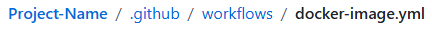

Visual Studio Code:

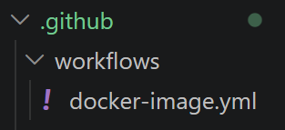

Now with that, we just need to make a docker compose file that references said image. 

***

### Step 7: Making your Docker Compose file

The docker composer file has all the commands you would normally use to run the container. We give it where to start (`build .`), what to build (`image: ghcr.io/your-username/project-name:latest`), what port to host it on (`ports: - "80:80"`), and the environment for the files (`environment: - PROXY_PREFIX=/app/WORKSPACE-ABBREVIATION`).

This is the `docker-compose.yml` file for the demo app:

``` yml
services:
  web:
    build: .
    image: ghcr.io/hamsamm/harp-seal-checker:latest
    ports:
      - "80:80"
    environment:
      - PROXY_PREFIX=/app/FEWSC
```
>Note:
>
> To find the PROXY_PREFIX, look at the "Web Application Information" in the Web App Configuration tab. 
> 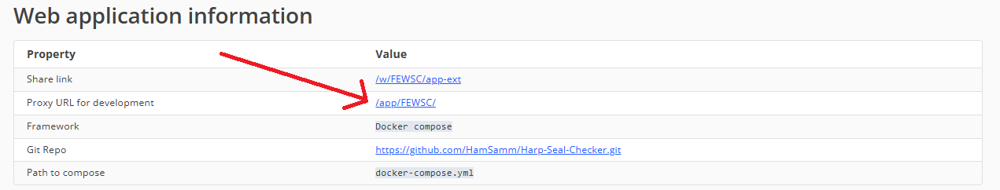


Place this file in the base of the directory (where requirements.txt is).

***

### Step 8: Deploying on FSDH

Once tested, you are ready to upload this container directly to your FSDH dashboard:
1. Push your code repository directly to GitHub.
2. In your FSDH workspace dashboard, navigate to the **Web Apps** tool and click **View Web App Configuration**.

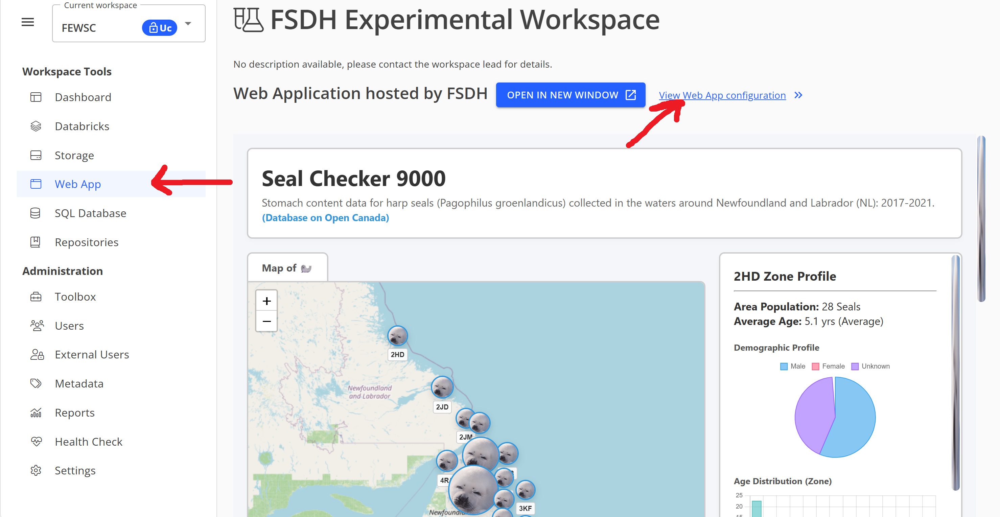

3. Link your GitHub repository and enter docker-compose.yml


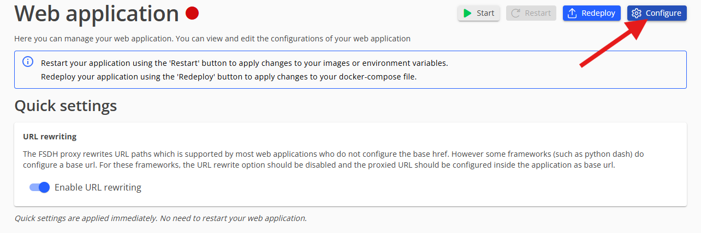
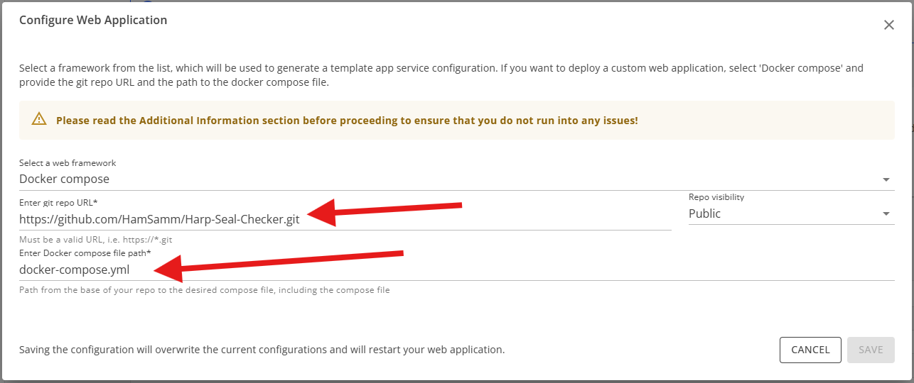

4. Add your system variables under environment settings:
   * **Key:** `SAS`
   * **Value:** *[Your active Azure Storage SAS URL]*

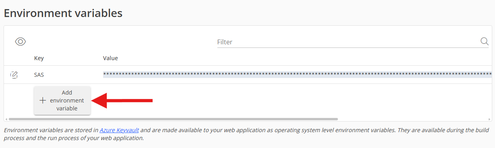
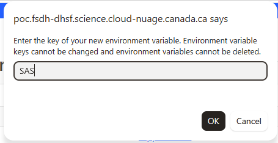
> You can leave the value blank and change it later

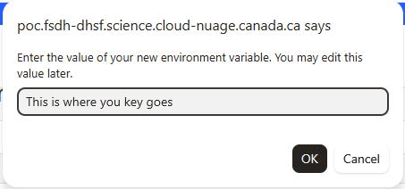

5. Click **Deploy**.

6. Once you've confirmed it works, make sure to turn off debug mode. 

``` python
if __name__ == '__main__':
    app.run(host='0.0.0.0', port=80, debug=False)
```

### Known Issues

Do note that whenever you have an issue, consult the logs, the console (f12), then the better logs (call someone who has access to them.) This generally gives you a good idea of what the issue is. 

Also sometimes it just takes a while for your webstie to load. Processing files takes time.

#### CSS and JS not loading
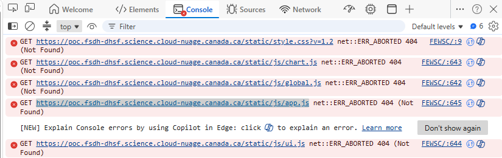
This error is the most obvious because your website would look something like this (Lacking any and all css/js)
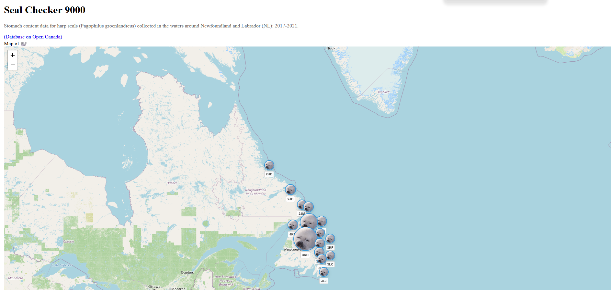
Most of the steps so far have been written under the assumption that the base path isn't changed. At the time of writting the web hosting tool changes the base of the url to `/app/WORKSPACE-ABBREVIATION`. This causes a few problems, it means whenever you referenced in your html file (files not stored on the fsdh), it won't be able to find it. 2 common problems that may occur due to this are the css and js files not running and having page switching not working. 

This is the workaround used in the demo project
``` python
class FSDHProxyPrefixFix:
    def __init__(self, wsgi_app):
        self.wsgi_app = wsgi_app

    def __call__(self, environ, start_response):
        # Force Flask to prefix every url_for() path with /app/FEWSC
        environ["SCRIPT_NAME"] = "/app/FEWSC"
        return self.wsgi_app(environ, start_response)

app.wsgi_app = FSDHProxyPrefixFix(app.wsgi_app)
```

Around March 2027 this shouldn't be a problem anymore. 