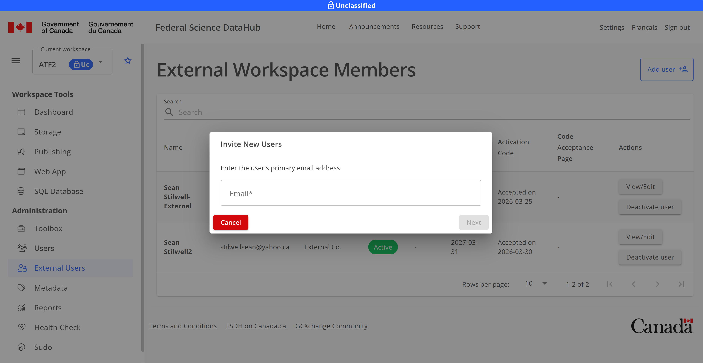
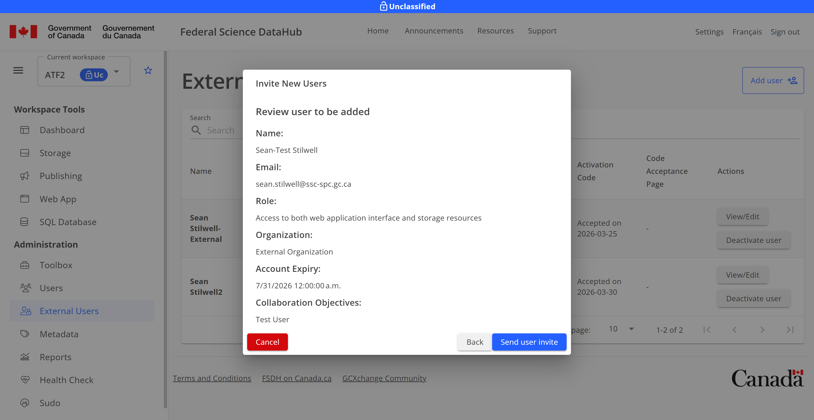
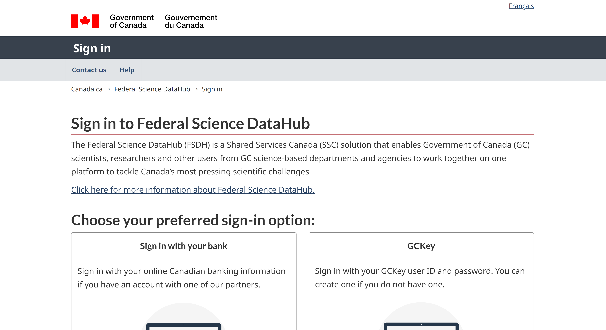
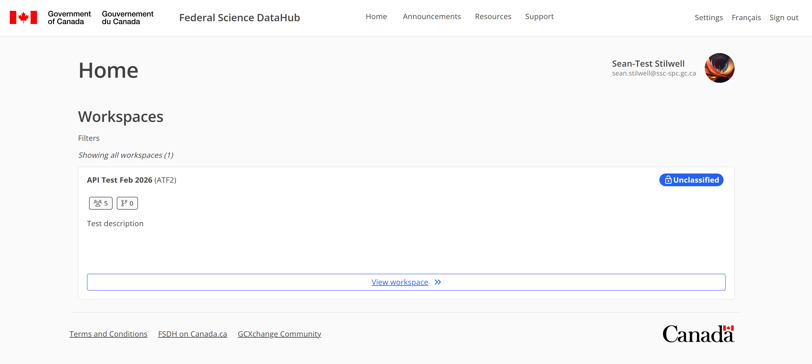

# Invite an external user

This guide is a walkthrough of how to invite and log in as an external user.

## Invite External User from FSDH Portal

> **Note:** Only `Workspace Lead` users can invite external users to a workspace.

1. Access the External Users page from your workspace
   

2. Click Add User to add a new external user
   

3. Enter the email address then click Next.
   

4. Fill out the form with the user's name, organization, role, and expiry date then click Next.
   

5. Provide the collaboration objectives then click Next. For testing, you can just indicate it's a test user.
   

6. Review the information and click Send user invite if the information is accurate.
   

7. On the external user page, you will see an activation code. Provide this to the external user via secure means, they require it later for account activation.
   

## Accepting an Invite to a Workspace

**Prerequisite:** You must have received an email from the FSDH before attempting to sign in. This email has an acceptance link you must use to accept the invitation.

1. From the email, open the link provided to activate your account. You will be taken to the external sign in page where you can use either your Interac banking login or a GCKey to sign in.
   

2. Select either "Sign in with your bank" or "GCKey". **Note:** The FSDH does not see any personal information from either option.

3. Complete the sign in, contact GCCF for any support questions at this point.

4. Once signed in, you will be redirected to the activation page. Activate your account using the activation code from your workspace lead.
   

5. If successful, you should be taken to the Invitation validated page. Click Go to Homepage
   

6. You are now signed in and can use the portal.
   
