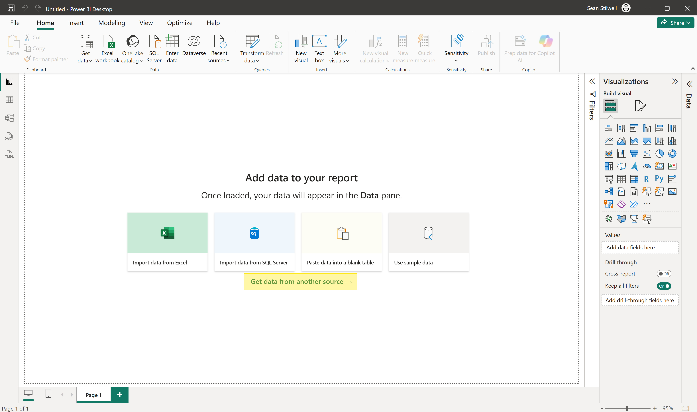
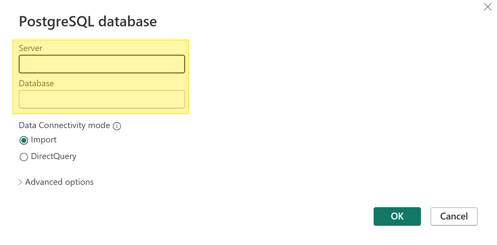
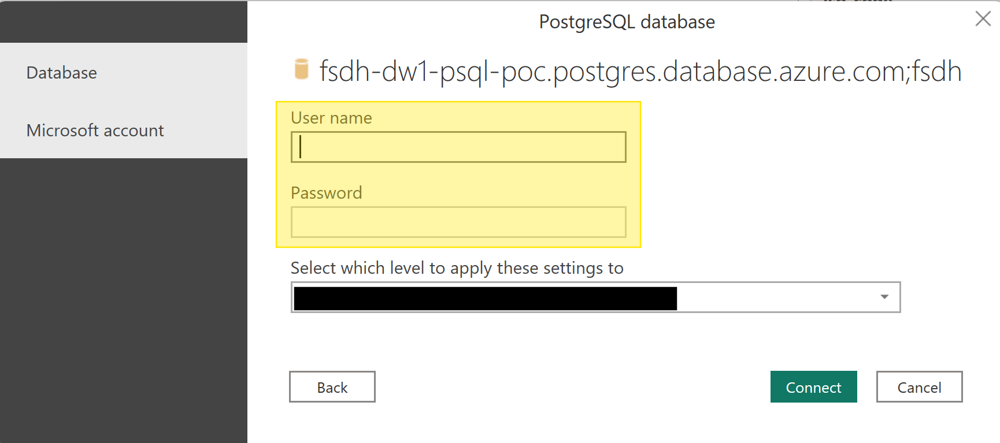

# Access PostgreSQL in Power BI

You can connect to your FSDH PostgreSQL database from Power BI by following these steps.

Ensure that you have Power BI Desktop installed and that you have added your machine to the PostgreSQL firewall, see the [PostgreSQL documentation](./Postgres.md) for how to do this.

1. In Power BI, click "Get data from another source".

2. Search for "Azure Database for PostgreSQL" in the search field, select it then click Connect.

3. Enter your host name for Server and "fsdh" for Database (by default).

4. Enter the username and password to connect to your database.

5. Select your tables and click Load to load the data.

Your data is now accessible from Power BI.