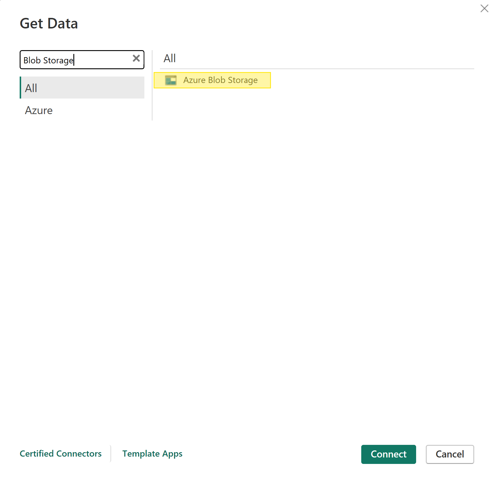
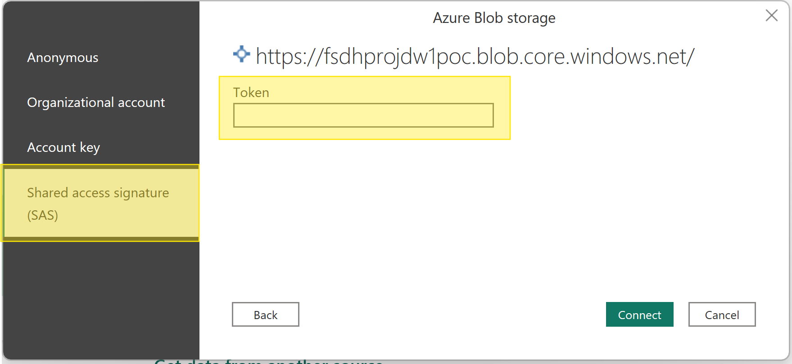
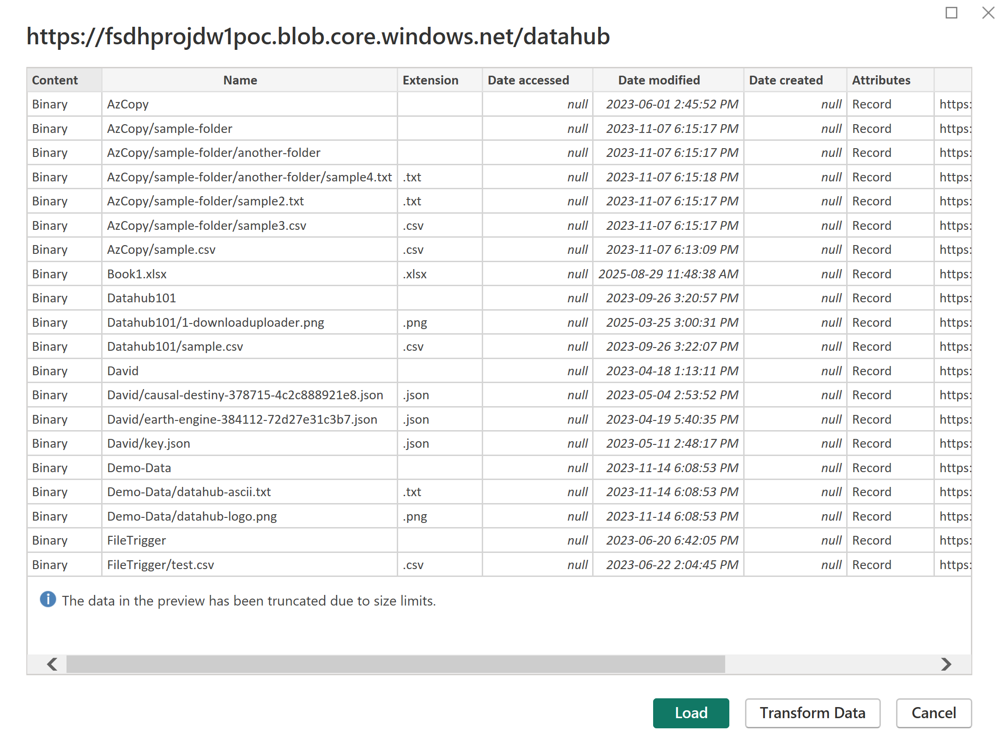

# Access Storage in Power BI

You can connect to your FSDH storage from Power BI by following these steps.

To do this, you must obtain an SAS token for your data. You should also have the name of your storage account ready, which can be found on the FSDH Storage Explorer beside the "Current Container" heading.

1. In Power BI, click "Get data from another source".


2. Search for "Blob Storage" in the list of options.


3. Copy the name of your FSDH storage account into the field.


4. Select to use a SAS token, copy your SAS token into the field.


5. You can then import your data. By default, this imports a list of blobs in your container, but you can customize the queries accordingly. Some sample queries are provided below.


## Sample Queries

We have some sample queries to help load your data:

### Load a CSV file

```
let
    fileUrl = "https://<storage_account>.blob.core.windows.net/datahub/<file_path>.csv?<token>",
    source = Csv.Document(Web.Contents(fileUrl),[Delimiter=",", Encoding=1252, QuoteStyle=QuoteStyle.None]),
    file = Table.PromoteHeaders(source)
in
    file
```