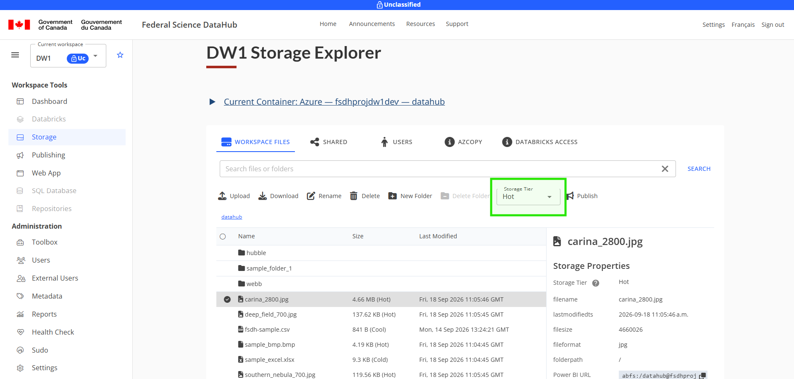
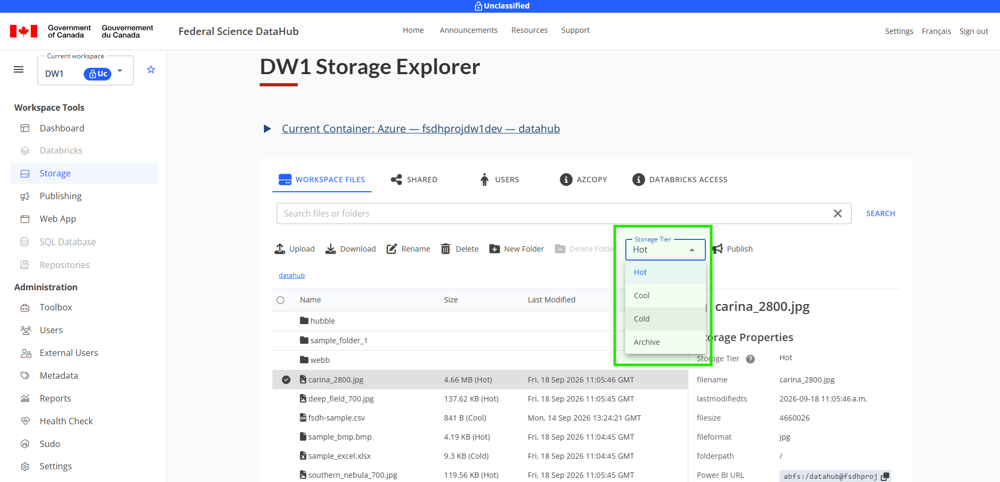
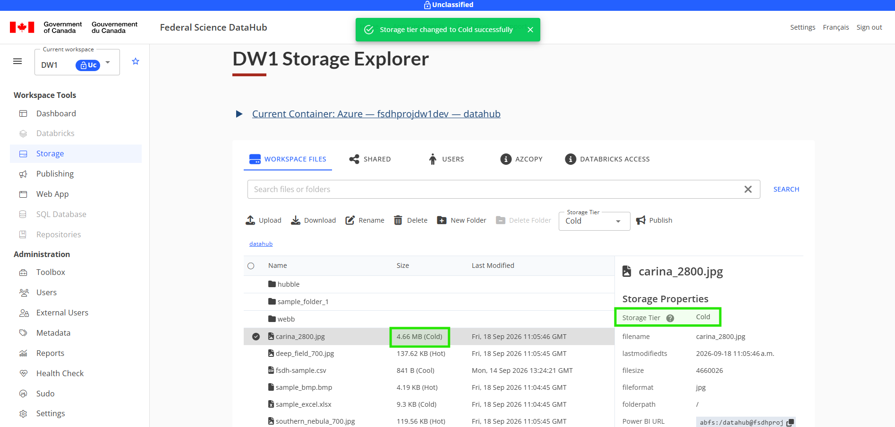

# Storage Tiers

Storage tiers provide an effective way to manage data based on its value, access patterns, and lifecycle stage. They let you optimize costs by keeping frequently accessed "hot" data on faster, more expensive tiers, while archival "cold" data moves to cheaper, slower tiers.

## Setting Storage Tiers for Data

To set a storage tier, follow these steps:

1. Visit the Storage Explorer on the Federal Science DataHub.
2. If applicable, switch to the storage container you'd like to use.
3. Select a file to modify its storage tier. Note that the storage tier dropdown becomes available in the menu.
    
4. Select the storage tier dropdown and choose one of the available options.
    
5. After picking the storage tier, you should see it update in the UI, both in the File Explorer itself and on the File Properties section. You should also see a banner.
    

## Notes for archive storage tiers

Archived storage is not kept readily accessible in cloud storage. This means you have to "re-hydrate" archived storage before you can download it again.

For the default storage container or for Azure containers, you can re-hydrate data by updating the storage tier in the Storage Explorer. This can take several hours to process.

The Storage Explorer does not support re-hydrating Google Cloud or AWS storage containers.

## Learn more

* [Access tiers for blob data - Microsoft Azure](https://learn.microsoft.com/en-ca/azure/storage/blobs/access-tiers-overview)
* [Amazon S3 Storage Classes - AWS](https://aws.amazon.com/s3/storage-classes/)
* [Storage classes - Google Cloud](https://docs.cloud.google.com/storage/docs/storage-classes)