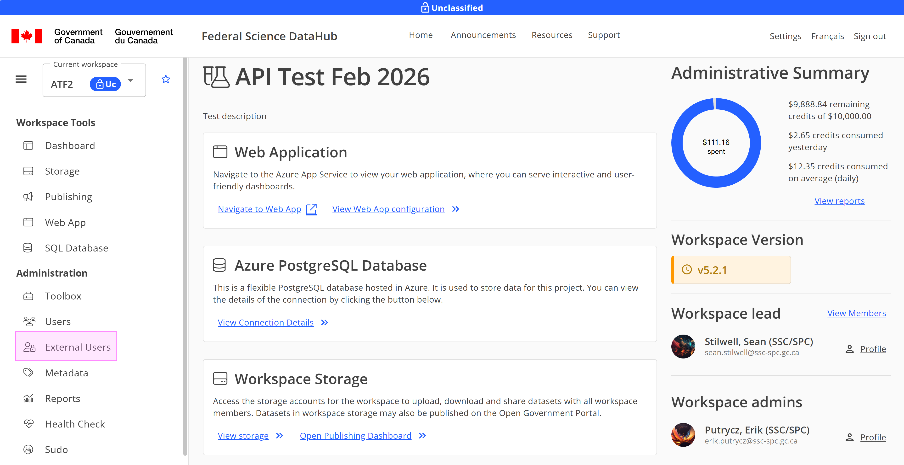
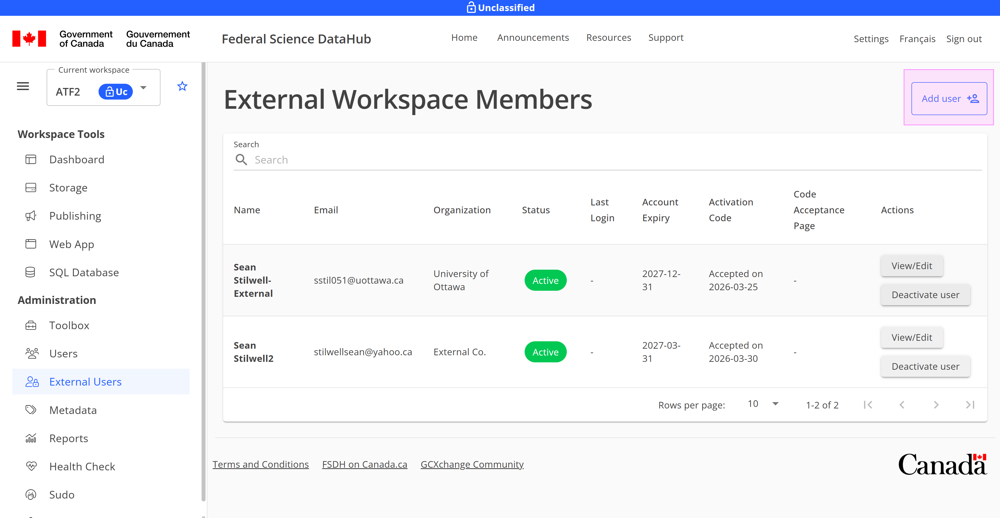
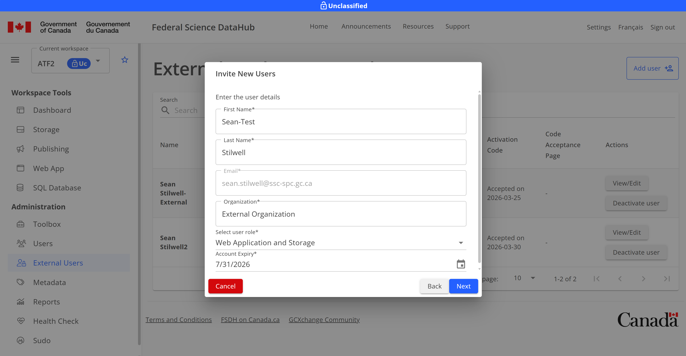
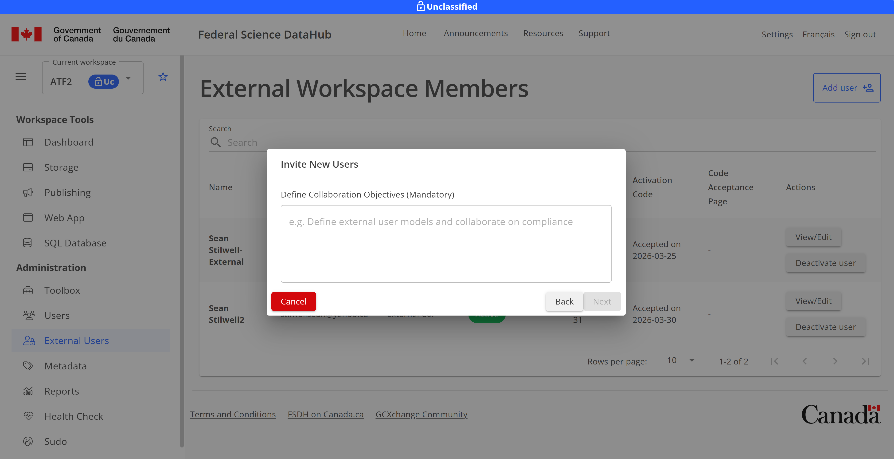
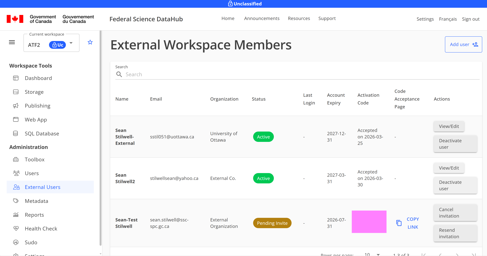
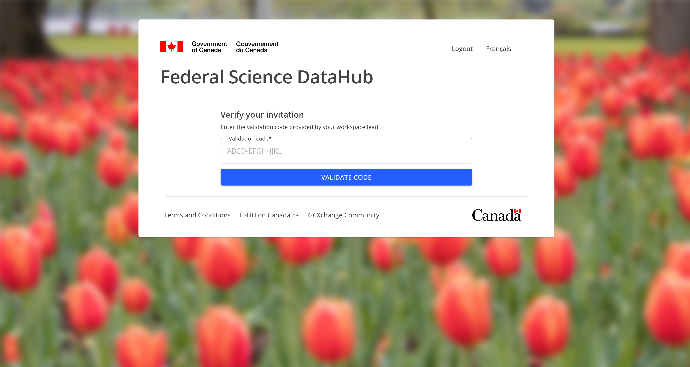
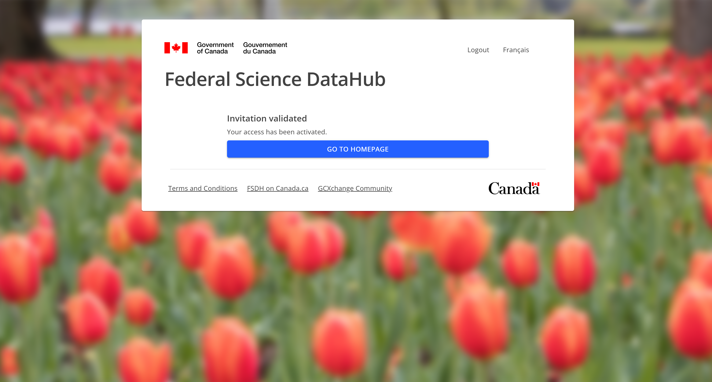

# Gestion des utilisateurs externes

Ce guide est une présentation de la façon d'inviter et de se connecter en tant qu'utilisateur externe.

## Inviter un utilisateur externe depuis la PFDS

> **Remarque :** Seuls les utilisateurs `Chef de l'espace de travail` peuvent inviter des utilisateurs externes à un espace de travail.

1. Accédez à la page des utilisateurs externes de votre espace de travail

2. Cliquez sur Ajouter un utilisateur pour ajouter un nouvel utilisateur externe

3. Entrez le courriel, puis cliquez sur Suivant.

4. Remplissez le formulaire avec le nom de l'utilisateur, l'organisation, le rôle et la date d'expiration, puis cliquez sur Suivant.

5. Fournissez les objectifs de collaboration, puis cliquez sur Suivant. Pour les tests, vous pouvez simplement indiquer qu'il s'agit d'un utilisateur de test.

6. Passez en revue les informations et cliquez sur Envoyer l'invitation à l'utilisateur si les informations sont exactes.

7. Sur la page de l'utilisateur externe, vous verrez un code d'activation. Fournissez-le à l'utilisateur externe par des moyens sécurisés, ils en auront besoin plus tard pour l'activation du compte.

## Accepter une invitation à un espace de travail

**Prérequis:** Vous devez avoir reçu un courriel de la PFDS avant de tenter de vous connecter. Ce courriel contient un lien d'acceptation que vous devez utiliser pour accepter l'invitation.

1. À partir du courriel, ouvrez le lien fourni pour activer votre compte. Vous serez dirigé vers la page de connexion externe où vous pouvez utiliser soit votre connexion bancaire Interac, soit un GCKey pour vous connecter.

2. Sélectionnez soit "Connectez-vous avec votre banque" ou "GCKey". **Remarque :** La PFDS ne voit aucune information personnelle de l'une ou l'autre option.

3. Terminez la connexion, contactez le GCCF pour toute question de support à ce stade.

4. Une fois connecté, vous serez redirigé vers la page d'activation. Activez votre compte à l'aide du code d'activation de votre chef d'espace de travail.

5. Si vous réussissez, vous devriez être dirigé vers la page d'invitation validée. Cliquez sur Aller à la page d'accueil

6. Vous êtes maintenant connecté et pouvez utiliser le portail.
