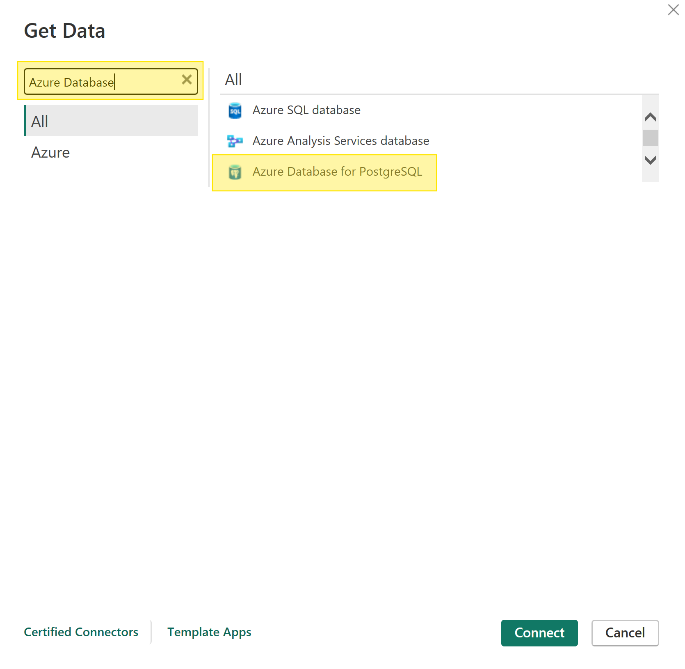
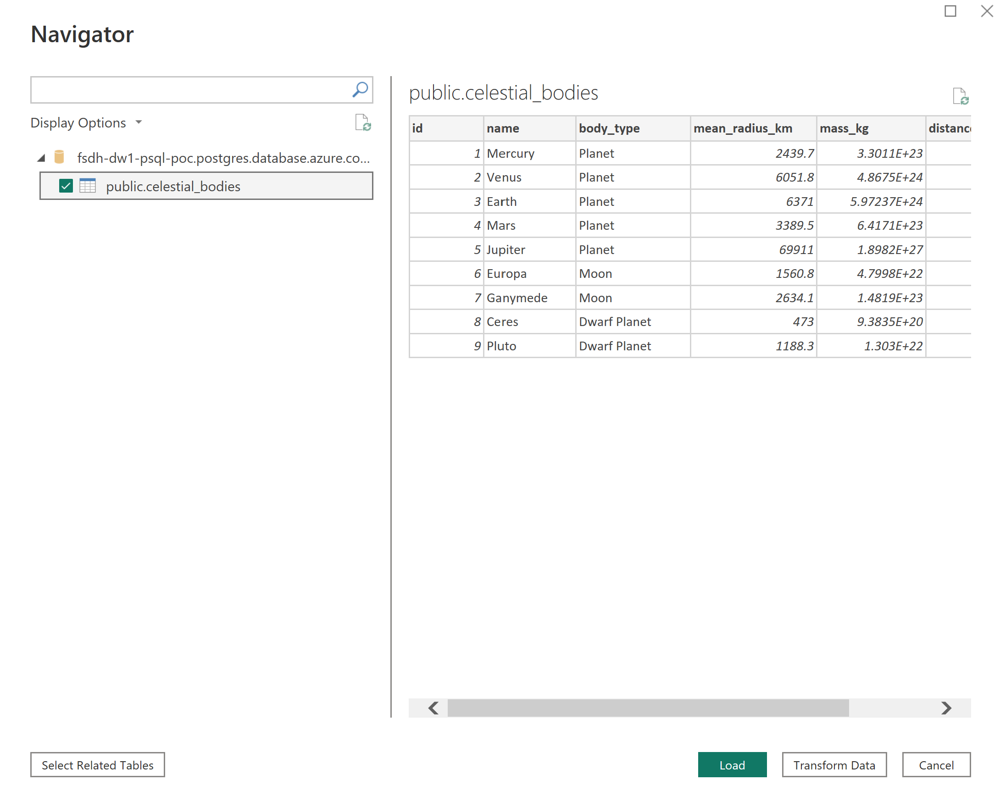

# Accéder à PostgreSQL dans Power BI

Vous pouvez vous connecter à votre base de données PostgreSQL sur la PFDS à partir de Power BI en suivant ces étapes.

Assurez-vous que Power BI Desktop est installé et que vous avez ajouté votre ordinateur au pare-feu PostgreSQL, consultez la [documentation PostgreSQL](./Postgres.md) pour savoir comment procéder.

1. Dans Power BI, cliquez sur « Obtenir des données d’une autre source ».

2. Recherchez « Azure Database for PostgreSQL » dans le champ de recherche, sélectionnez-le puis cliquez sur Connecter.

3. Entrez votre nom d’hôte pour Serveur et « fsdh » pour Base de données (par défaut).

4. Entrez le nom d’utilisateur et le mot de passe pour vous connecter à votre base de données.

5. Sélectionnez vos tables et cliquez sur Charger pour charger les données.

Vos données sont maintenant accessibles à partir de Power BI.