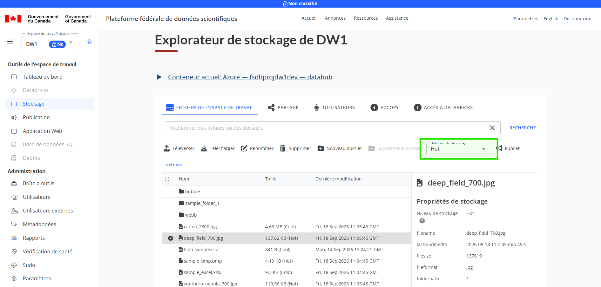
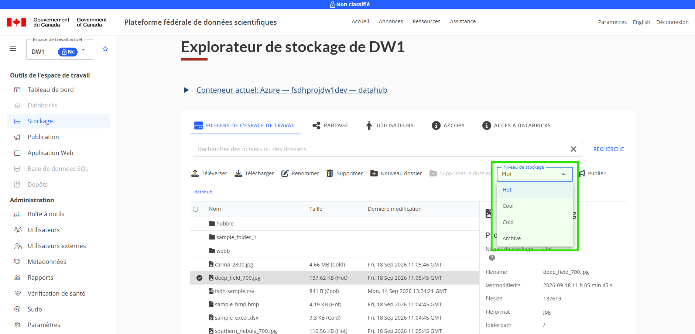
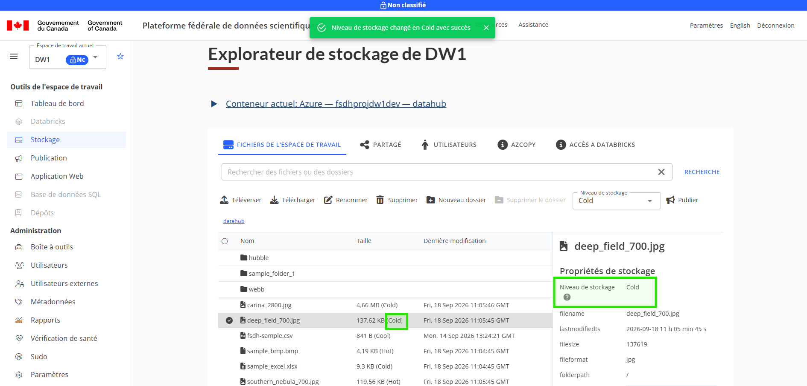

# Niveaux de stockage

Les niveaux de stockage constituent un moyen efficace de gérer les données en fonction de leur valeur, de leurs modèles d’accès et de leur étape de cycle de vie. Ils vous permettent d’optimiser les coûts en conservant les données « chaudes » fréquemment consultées sur des niveaux plus rapides et plus coûteux, tandis que les données « froides » d’archivage sont déplacées vers des niveaux moins chers et plus lents.

## Définir les niveaux de stockage pour les données

Pour définir un niveau de stockage, suivez ces étapes :

1. Accédez à l’Explorateur de stockage sur la Plateforme fédérale de données scientifiques.
2. Le cas échéant, basculez vers le conteneur de stockage que vous souhaitez utiliser.
3. Sélectionnez un fichier pour modifier son niveau de stockage. Notez que le menu déroulant du niveau de stockage devient disponible dans le menu.
    
4. Sélectionnez le menu déroulant du niveau de stockage et choisissez l’une des options disponibles.
    
5. Après avoir choisi le niveau de stockage, vous devriez le voir mis à jour dans l’interface utilisateur, à la fois dans l’Explorateur de fichiers lui-même et dans la section Propriétés du fichier. Vous devriez également voir une bannière.
    

## Remarques sur les niveaux de stockage d’archivage

Le stockage d’archives n’est pas conservé facilement accessible dans le stockage cloud. Cela signifie que vous devez « réhydrater » le stockage d’archives avant de pouvoir le télécharger à nouveau.

Pour le conteneur de stockage par défaut ou pour les conteneurs Azure, vous pouvez réhydrater les données en mettant à jour le niveau de stockage dans l’Explorateur de stockage. Cela peut prendre plusieurs heures à traiter.

L’Explorateur de stockage ne prend pas en charge la réhydratation des conteneurs de stockage Google Cloud ou AWS.

## En savoir plus

* [Niveaux d’accès pour les données d’objets blob](https://learn.microsoft.com/fr-ca/azure/storage/blobs/access-tiers-overview)
* [Classes de stockage Amazon S3 - AWS](https://aws.amazon.com/fr/s3/storage-classes/)
* [Classes de stockage - Google Cloud](https://docs.cloud.google.com/storage/docs/storage-classes?hl=fr)