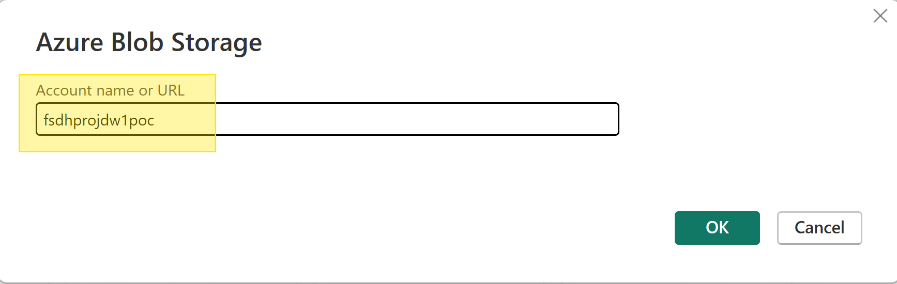

# Accéder au stockage dans Power BI

Vous pouvez vous connecter à votre stockage sur la PFDS à partir de Power BI en suivant ces étapes.

Pour ce faire, vous devez obtenir un jeton SAS pour vos données. Vous devriez également avoir le nom de votre compte de stockage à portée de main, que vous trouverez dans l’explorateur de stockage de la PFDS, à côté de l’en-tête « Conteneur actuel ».

1. Dans Power BI, cliquez sur « Obtenir des données d’une autre source ».


2. Recherchez « Stockage Blob » ou « Blob Storage » dans la liste des options.


3. Copiez le nom de votre compte de stockage sur la PFDS dans le champ.


4. Sélectionnez pour utiliser un jeton SAS, copiez votre jeton SAS dans le champ.


5. Vous pouvez ensuite importer vos données. Par défaut, cela importe une liste d’objets blob dans votre conteneur, mais vous pouvez personnaliser les requêtes en conséquence. Des exemples de requêtes sont fournis ci-dessous.


## Exemples de requêtes

Nous avons quelques exemples de requêtes pour vous aider à charger vos données:

### Charger un fichier CSV

```
let
    fileUrl = "https://<compte_stockage>.blob.core.windows.net/datahub/<piste>.csv?<jeton>",
    source = Csv.Document(Web.Contents(fileUrl),[Delimiter=",", Encoding=1252, QuoteStyle=QuoteStyle.None]),
    file = Table.PromoteHeaders(source)
in
    file
```